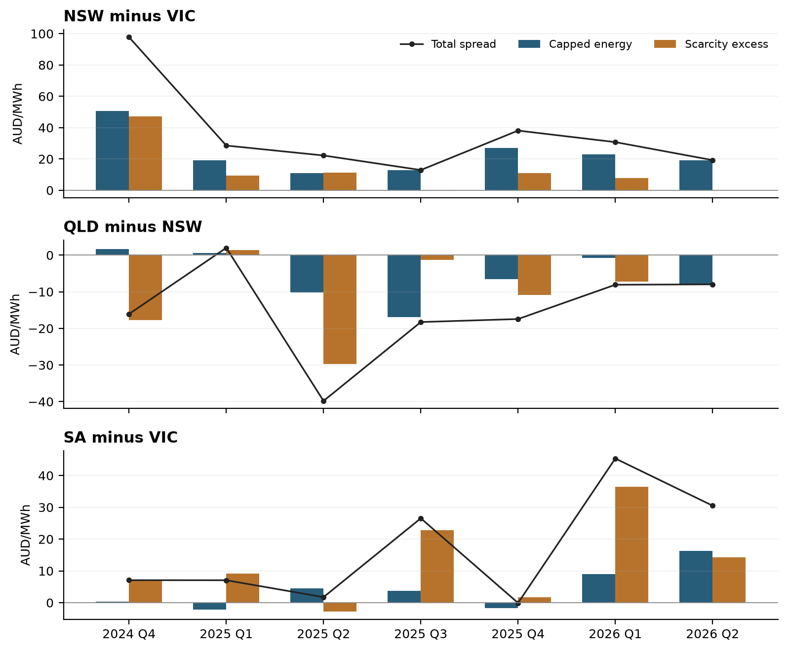

# Valuing quarterly interregional electricity spreads

## Research purpose and recommendation

Prepared for the IC Flow Forecasting project. Research date 18 September 2026. Australian National Electricity Market. All prices are AUD per MWh unless stated otherwise; SRA prices are AUD per unit. Time is fixed NEM time, UTC plus 10 hours.

The objective is to estimate quarterly interregional value from the joint behaviour of regional electricity prices and interconnector flows, explain how much comes from ordinary energy prices and how much from prices above $300, identify the conditions that generate those outcomes, and compare the result with futures and settlement residue auction prices.

The recommended approach is a **joint scenario model with a separate contract settlement layer**. Simulate demand, renewable availability, generation availability, storage, network constraints, prices and flows together. Calculate regional quarterly averages, $300 cap payouts and SRA distributions on every scenario. Preserve both a physical forecast distribution and a separately calibrated market valuation distribution. The difference between them is the starting point for a trade thesis, subject to uncertainty, liquidity and portfolio risk.

An accurate forecast of average interconnector flow is insufficient. A price spread can widen when a constraint prevents flow, precisely when an SRA provides a weak hedge. Conversely, substantial flow can produce little residue when regional prices converge. The relevant quantity is the joint distribution of **price separation, deliverable transfer and the contractual allocation of residue**.

There are three immediate priorities. First, use five-minute prices to build an exact energy and scarcity decomposition. Second, reconcile the SRA settlement engine against published AEMO outcomes before forecasting its payout. Third, build a quarterly scenario generator around the existing QNI and VNI research, with explicit uncertainty in future fundamentals. A richer flow algorithm should be added only when it improves contract valuation or hedge performance.

This report combines primary market documentation, academic papers, original practitioner analysis and a new descriptive analysis of the project's archived prices. It provides a research and implementation design, rather than an executable recommendation to buy a particular quarter. Numerical market examples retain their observation dates. Illustrative valuations are labelled explicitly.

## 1 The questions the model must answer

For each region pair, direction, delivery quarter and valuation date, the model should answer six questions:

1. What is the expected time-weighted regional price difference, and its distribution?
2. How much comes from the capped energy component and from the excess above $300?
3. How often does only one region spike, how long do episodes last, and how severe are they?
4. What flows and settlement allocations occur in those same episodes?
5. What assumptions about scarcity, dependence and transmission availability would reconcile model values with market prices?
6. Which instrument best expresses or hedges the exposure after transaction costs, margin requirements and downside risk?

Use three separate meanings of capacity. **Generation adequacy** concerns available supply relative to demand. **Transfer capability** concerns the feasible network movement of power. **Scarcity value** is the high-price premium paid in energy prices and captured by a cap contract. An SRA is an entitlement to allocated residue; it is not ownership of physical transfer capacity. A $300 exceedance is a useful financial definition, but does not establish a physical shortage or a particular bidding mechanism. Prices below $300 can still contain congestion rents or scarcity-related opportunity costs.

The first implementation should cover QNI and VNI in both directions, but the VNI scenario engine must include South Australia and EnergyConnect. A two-region VNI model cannot represent the forthcoming three-region loop settlement allocation. Add Heywood, Murraylink and Basslink through effective-dated physical and contractual mappings. Do not infer settlement treatment solely from historical interconnector identifiers.

## 2 Instruments and the object being valued

Let A be the origin region and B the destination. Define the signed spot spread as P_B minus P_A. A positive spread means the destination is more expensive. A long spread position means long the destination regional future and short the origin regional future, with matched delivery hours and MW exposure.

| Instrument | Economic exposure | Natural reporting unit |
|---|---|---|
| Regional base future | Quarterly arithmetic mean of regional spot price | AUD per MWh |
| Matched interregional futures legs | Difference between two regional quarterly means | AUD per MWh and AUD per MW-quarter |
| Regional $300 cap future | Average positive excess of spot price over $300 | AUD per MWh |
| Difference of regional caps | Difference between regional scarcity-excess payouts | AUD per MWh |
| Base spread less cap spread | Difference between prices clipped above at $300 | AUD per MWh |
| Directional SRA unit | Contractual fraction of distributable directional residue | AUD per unit |

ASX's June 2025 fact sheet specifies one MW base exposure and five-minute averaging for relevant contracts from October 2021. Quarterly hours vary with calendar length: 2,160, 2,184 or 2,208. The cap settlement calculation averages the positive excess above $300 over all base intervals. Contract rules and rounding must be implemented as specified for the delivery product. [S01]

ASX's published interregional spread convention deserves special attention: its 2014 launch notice states that buying a displayed spread buys the second, dominant leg and sells the first. Therefore the screen label can be misleading if read as ordinary subtraction. Map an executable order into explicit long and short regional legs; confirm the current broker and exchange convention before implementation. [S02]

A time-weighted quarterly future differs from a load-weighted customer exposure and from a flow-weighted residue. Keep all three quantities separate. A retailer's exposure may require multiplying regional prices by stochastic load, which introduces additional price-volume dependence. It cannot be hedged precisely by a flat one-MW spread merely because average prices match.

For a flat m-MW long spread, terminal economic profit before funding and costs is m times H times the difference between realised quarterly spread and entry spread. Futures are margined through time, so this terminal identity does not describe the path of liquidity requirements. An SRA unit instead requires its own purchase, payment, fee and distribution cashflow schedule.

## 3 The exact energy and scarcity decomposition

Choose K = 300. For each regional price define E_r,t = min(P_r,t, K) and C_r,t = max(P_r,t minus K, 0). Then:

`P_r,t = E_r,t + C_r,t`

`Spread_BA,t = (E_B,t - E_A,t) + (C_B,t - C_A,t)`

`Quarterly spread = quarterly capped-energy spread + quarterly scarcity-excess spread`

This is an accounting identity for every observation and scenario. It retains negative prices within the energy component. At exactly $300 the cap excess is zero. Use the same interval weights in all three terms.

This definition of energy includes the first $300 of a high-price interval. It differs from averaging only observations below $300. The conditional average price on non-spike intervals changes its sample when event frequency changes and does not replicate a simple base-minus-cap position. Report that conditional average as a diagnostic, but use the additive capped decomposition for valuation.

For example, if A is $100 and B is $1,000, the total spread is $900: $200 of capped energy and $700 of scarcity excess. If A is $2,000 and B is $3,000, both regions are scarce but the spread is $1,000, entirely in the scarcity component. A simultaneous price spike in both regions need not create a large spread; its contribution depends on relative severity.

### Four joint price states

| State | Definition | Scarcity spread contribution |
|---|---|---|
| Neither spikes | A at or below $300; B at or below $300 | Zero |
| Destination only | A at or below $300; B above $300 | Positive |
| Origin only | A above $300; B at or below $300 | Negative |
| Both spike | A and B above $300 | Difference between excesses |

Report state frequency, conditional spread, hours, episode counts, directional flow and contribution to quarterly value. For each state z, its contribution is probability of z times expected spread conditional on z. Summing the four contributions reconstructs the quarterly mean. Split the neither-spikes state further into negative-price and nonnegative-price observations to explain renewable-surplus effects.

### A direct market decomposition

Let F_r denote a regional base futures quote and G_r the corresponding $300 cap futures quote, with matched quarter and timestamp. Construct:

`Market total spread = F_B - F_A`

`Market scarcity spread = G_B - G_A`

`Market capped-energy spread = (F_B - G_B) - (F_A - G_A)`

These are prices of replicating combinations, subject to bid-ask costs, settlement rounding and funding conventions. They provide the cleanest observable answer to how much energy and scarcity value is priced into the regional futures spread. They are not a unique statement of the market's physical probabilities. No option-pricing inversion is required to perform this decomposition; interpreting it as an expected event count does require additional assumptions.

Do not calculate a scarcity percentage when the total spread is close to zero. Components can offset, change sign or exceed 100% of the net total. Report dollar contributions and, where useful, the absolute-component ratio abs(scarcity) divided by abs(energy) plus abs(scarcity).

## 4 Evidence from the existing project data

A fresh calculation used 210,240 five-minute timestamps from after 1 September 2024 00:00 through 1 September 2026 00:00, across NSW, Queensland, Victoria and South Australia. This is 840,960 regional price observations. Duplicate copies shared between connector datasets agreed exactly. The retained price matrix has no missing timestamps or regional prices. The decomposition reconstructs each price exactly at the stored precision. [L01]

Intervals are assigned to their delivery quarter using the instant immediately before the interval-ending timestamp. Seven complete quarters are available, Q4 2024 through Q2 2026. September 2024 and July-August 2026 are partial quarters and excluded from the complete-quarter comparisons. Prices are archived non-intervention dispatch RRP observations, not an independently certified series of final ASX settlement prices. The dataset includes 95 regional rows with nonzero administered-price flags and 146 with nonzero suspension flags; these remain in the economic price history and should also be evaluated separately.

### Complete-quarter spread decomposition

The following are destination minus origin averages, in AUD per MWh. Values are rounded independently.

| Quarter | Pair | Total spread | Capped energy | Scarcity excess |
|---|---|---:|---:|---:|
| 2024 Q4 | NSW minus VIC | 97.75 | 50.54 | 47.21 |
| 2025 Q1 | NSW minus VIC | 28.55 | 19.24 | 9.30 |
| 2025 Q2 | NSW minus VIC | 22.21 | 10.87 | 11.34 |
| 2025 Q3 | NSW minus VIC | 12.92 | 12.78 | 0.14 |
| 2025 Q4 | NSW minus VIC | 38.10 | 27.15 | 10.94 |
| 2026 Q1 | NSW minus VIC | 30.74 | 23.06 | 7.68 |
| 2026 Q2 | NSW minus VIC | 19.24 | 19.24 | -0.002 |
| 2025 Q2 | QLD minus NSW | -39.80 | -10.14 | -29.67 |
| 2026 Q1 | QLD minus NSW | -8.08 | -0.80 | -7.28 |
| 2026 Q2 | QLD minus NSW | -7.97 | -7.97 | 0.001 |
| 2025 Q3 | SA minus VIC | 26.54 | 3.73 | 22.80 |
| 2026 Q1 | SA minus VIC | 45.35 | 8.95 | 36.40 |
| 2026 Q2 | SA minus VIC | 30.51 | 16.28 | 14.24 |

The value composition changes materially between quarters. In Q4 2024 the NSW-VIC spread contains nearly equal energy and scarcity components. In Q2 2026 its scarcity component is effectively zero. In Q1 2026 about $36.40 of the $45.35 SA-VIC spread comes from differential scarcity excess. A model fitted only to quarterly average flow would have to explain fundamentally different economic states with the same summary target.

### Scarcity frequency and concentration

| Quarter and region | Hours above $300 | Consecutive episodes | Average cap excess | Top five days share of cap excess |
|---|---:|---:|---:|---:|
| NSW 2024 Q4 | 44.25 | 151 | 47.36 | 75.33% |
| NSW 2025 Q2 | 45.25 | 85 | 54.33 | 85.17% |
| VIC 2025 Q2 | 49.92 | 81 | 42.99 | 98.62% |
| SA 2026 Q1 | 32.75 | 112 | 37.54 | 97.07% |
| SA 2026 Q2 | 49.25 | 112 | 14.24 | 99.60% |

Episodes here mean uninterrupted runs of five-minute prices above $300, split at quarter boundaries. They are not distinct weather systems or operational incidents. One difficult day can contain many short episodes. The top-five-day statistic demonstrates concentration but does not establish the probability of a future event. SA Q2 2026 had more hours above $300 than Q1, yet a much smaller cap payout; severity matters as much as frequency.

For SA Q2 2026, 49.25 hours above $300 represent 2.255% of the quarter. Mean excess conditional on those intervals was approximately $631.67. Their product is the $14.24 quarterly average cap excess. This is a directly checkable frequency-severity identity.

### The cost of averaging too early

For NSW Q4 2024, calculating the cap from five-minute prices gives $47.355/MWh; clipping half-hour averages gives $46.505/MWh. The understatement is about $0.850/MWh, or $1,878 for one MW across that quarter. For VIC Q4 2024, the cap falls from $0.1487 to $0.0840 when calculated after averaging. Absolute errors and percentage errors tell different stories.

Mathematically, the positive-part function is convex: the cap on an average cannot exceed the average of caps. A half-hour flow model can still be useful, but a quarterly payoff engine needs a calibrated five-minute bridge. Similarly, average flow times average spread loses within-period covariance.

### A diagnostic of flow and spread dependence

Using each connector's dispatch MWFLOW, a deliberately simplified gross proxy was calculated as positive flow in a direction times positive regional spread, summed in MWh units. It omits losses, allocation rules, fees and other parallel links. It is **not SRA revenue**. Across the two-year sample, VIC-to-NSW's mean product was approximately 15,257 dollars per hour, versus 14,375 from multiplying the separate means of spread-gated flow and positive spread. For QLD-to-NSW those quantities were 17,192 and 7,370. [L01]

The sign and magnitude of dependence vary by route. This evidence rejects a blanket independence assumption; it does not identify a structural causal effect. Even this positive-product proxy can differ materially from a contractual residue, especially after loop allocation. The accompanying CSVs expose the exact calculation for review.

## 5 SRA settlement mechanics and the 2026 transition

### Start with a settlement function

Define an effective-dated function S that maps interval prices, relevant flows, losses, topology, allocation rules, unit entitlements and fees into participant cashflows. An SRA value is the expected discounted cashflow produced by S, adjusted for the required compensation for risk and financing. The model must price the contract actually purchased rather than a convenient physical proxy.

For an elementary directional transfer, raw residue has the form received energy times destination price minus exported energy times origin price. In a lossless illustration this becomes transferred MWh times the regional price difference. Actual AEMO residue incorporates the applicable loss and allocation methodology; it is not safely reconstructed from a single MWFLOW column and a price difference. Historical negative residues were recovered through the relevant network arrangements rather than simply charged to SRA holders as a signed spread obligation. [S03]

The 7 August 2026 SRA Rules specify units, proportional entitlements, distribution instalments, fees and reconciliation. Their unit definition and payment provisions include nonnegative distributions and a minimum SRDA distribution mechanism. Implement the exact clauses, including the $10-per-allocated-unit minimum where applicable, rather than applying a generic positive-part operation to a quarterly sum. Twelve auction tranches do not make one unit a claim on only one-twelfth of delivery-quarter hours. [S04]

Unit counts are financial allocation parameters, not a guarantee of transfer. A 2028 Q2 unit-category notice, for example, lists different maximum counts for NSWQLD, QLDNSW, NSWVIC and VICNSW, and 500 in each Basslink direction. Notices can be revised. Preserve the published proportional entitlement, maximum units, quarter and notice version; do not use the number sold in one auction as the denominator for a unit's share. [S05]

### EnergyConnect changes the mapping from physical flow to payout

The September 2025 AEMC final determination adopts a net-trade approach for the NSW-SA-VIC loop. The loop's loss-adjusted residue is pooled; allocation then depends on regional net trade and price differences. Positive and negative legs are netted through the prescribed calculation. Thus physical use of VNI does not by itself establish the amount distributed to VICNSW units. [S06]

In AEMO's May 2026 stakeholder reference paper, the intended operational dates are 1 October 2026 for loop dispatch representation and 1 November 2026 for the new settlement calculations. The paper distinguishes those dates explicitly. It also provides worked allocation and secondary-netting examples, including cases where some directional units receive no payout despite physical flow elsewhere in the loop. Treat the October transition as a distinct settlement regime and verify final implementation notices. [S07]

The implementation pattern should be:

1. Calculate raw, loss-adjusted amounts for all relevant loop arms for each settlement interval.
2. Calculate the net loop amount. Route negative-loop treatment and special cases through the applicable rules.
3. Derive regional net export/import quantities and the eligible notional trade directions.
4. Calculate notional trade values, loss reconciliation and secondary netting using the exact rule version.
5. Apply unit entitlements, fees, timing and reconciliation to the allocated results.

AEMO opened a consultation on the merged residue allocation, distribution and recovery methodology on 16 September 2026, with submissions due 29 September. As at this report date it is a draft consultation, not a final implemented procedure. It states that interconnectors outside the loop retain the existing methodology. The settlement engine therefore needs a rule-version registry with effective dates, rather than one universal equation. [S08]

AEMO's current EnergyConnect FAQ says negative residue management is assessed at whole-loop level from the October operational transition. This changes possible dispatch outcomes as well as financial allocation. Do not copy historical individual-link clamping patterns into a loop scenario without adjustment. [S09]

### Basslink and new categories

AEMO's April 2026 final consultation report adds VICTAS and TASVIC categories in preparation for Basslink's regulated conversion from July 2026 and changes the auction fee method. Its June auction report contains Basslink prices. Consequently, older descriptions that categorically exclude Basslink from SRAs are unsuitable for prospective valuation. Treat the conversion as a data and contract regime break, with registration and settlement mapping checked at the relevant dates. [S10, S11]

### Decomposing an SRA into energy and scarcity

For a fixed-flow, linear raw-residue calculation, replace each price by E plus C and allocate the two contributions algebraically. Once flooring, netting and loop allocation apply, the contract function can be nonlinear. Two separately calculated positive payouts will generally not sum to the actual payout.

Use one of two clearly labelled views. **Historical state attribution** assigns each actual interval's allocated payout to its observed price state; it sums to the total and requires no counterfactual. **Fixed-flow price decomposition** calculates S using the observed flows and clipped prices, then defines the tail increment as S at actual prices minus S at clipped prices. This also sums exactly, but the tail increment can be negative and is order-dependent. It is an accounting counterfactual, not an estimate of what dispatch would have been without scarcity.

For an economic scarcity counterfactual, rerun dispatch with the relevant scarcity or availability mechanism altered, then rerun settlement. This changes both flows and prices. If several mechanisms interact, use paired scenarios and an explicitly defined Shapley allocation over a small set of mechanisms, retaining a reconciliation residual. Do not call the fixed-flow result causal.

## 6 Why expected flow alone cannot determine value

The useful identity is E[flow times spread] = E[flow] times E[spread] plus Cov(flow, spread). Conditioning on direction, allocation gates and market regime adds further dependence. Quarter-average net flow can also hide large movement in both directions.

Three states illustrate the economics. With spare transfer capability, arbitrage tends to reduce price separation. With a binding import constraint and a tight importing region, high flows and large spreads may coexist. With an interconnector outage or severe restriction, regional separation can become extreme while the transferable volume collapses. The third state can be attractive for a regional spread position and poor for a physical-flow-linked residue entitlement.

In a lossless two-region model, increasing transfer capability initially lets more cheap generation displace expensive local generation. It may reduce the price spread, reduce scarcity probability, change flow, or all three. The effect on total residue need not be monotone: more MWh can be offset by a smaller spread. Evaluate an entire capacity-response curve rather than assume that a 10% capacity increase means 10% more SRA value.

Reported dispatch import and export limits are themselves functions of restrictive equations and the solved dispatch. Other generators and interconnectors appear in those equations. Treating each reported limit as an independent physical capacity can produce an impossible multi-region state. Preserve constraint coefficients, direction, effective versions and forced-flow cases. The existing project documentation already identifies this interpretation issue. [S12, L02]

Useful valuation sensitivities are a 100 MW change in an identified constraint RHS, one additional day of a named outage, a change in deliverable battery energy, or a renewable-output shock. Each sensitivity should state whether dispatch was reoptimised, bids held fixed, topology altered, or only a statistical conditional distribution changed. These are different experiments.

## 7 Triggers and how to establish their importance

Model triggers as combinations of conditions. A coal outage during mild demand and high wind is different from the same outage during a hot evening with low wind, an import constraint and depleted batteries. Separate the probability of a trigger from the probability and value of a price event conditional on that trigger.

| Mechanism | Information available before delivery | Expected transmission to value |
|---|---|---|
| High residual demand | Joint weather, demand, rooftop PV and VRE scenarios | Moves dispatch onto steeper offers and increases import requirement |
| Thermal outages or derating | MT PASA vintage, outage notices, temperature, unit history | Reduces accessible supply; severity depends on replacement capacity |
| Network outage or security constraint | Published outage plan, constraint sets, credible contingencies | Limits imports or changes the feasible dispatch and loop allocation |
| Low wind across several regions | Spatial weather ensembles and low-wind duration | Weakens geographic diversity and raises simultaneous scarcity risk |
| Evening ramp | Sunset, temperature persistence, wind ramps and unit ramp capability | Creates short periods when flexibility is more valuable than average energy |
| Storage depletion | Simulated charging history, MWh capacity, efficiency and competing uses | Sustains high prices after initially suppressing them |
| Renewable surplus | High available VRE, low operational demand, minimum generation | Creates negative prices and export constraints within the energy component |
| Offer and rebid changes | Publicly available offer history, fuel and opportunity costs | Changes the effective supply curve even when physical MW is unchanged |
| FCAS and system security | Joint energy-FCAS availability, local service requirements | Can restrict energy dispatch or support and alter regional prices |
| Market interventions and price rules | Known market notices and effective settings | Alters observed settlement and caps sustained tail outcomes |

The AER's Q2 2026 significant-price report summary identifies SA events involving cold-driven demand, very low wind, cascading battery state-of-charge reductions, network limitations and rebidding. This is direct evidence for modelling multi-hour energy depletion and interacting constraints. Its selected incidents are mechanism studies, not a random sample from which to estimate event frequency. [S13]

WattClarity's January 2025 analysis of multiple auto-clamping episodes provides an operational explanation of counter-price flows and negative-residue management. Use such original expert analyses to create falsifiable event hypotheses and check dispatch reconstructions. Do not turn historical clamping descriptions into permanent rules after the EnergyConnect transition. [S14]

### An accessible supply margin

Construct a region's supply margin from locally deliverable generation, available VRE, storage discharge feasible given state of charge, demand response and jointly feasible imports, less operational demand and relevant obligations. Track both MW headroom and MWh endurance. A 500 MW battery with little remaining energy cannot be treated as 500 MW of sustained support throughout a cold, low-wind evening.

Avoid double counting rooftop PV already embedded in an operational demand definition. Likewise, distinguish VRE availability from realised dispatch: curtailed generation is partly an outcome of congestion. Use historical available forecasts for predictive inputs; actual dispatch remains an explanatory outcome or an explicitly labelled conditional input.

### Predictive explanation and causal explanation

For predictive screening, fit simple conditional frequency tables, a logistic model or an additive model with predeclared interactions. Report sample counts, confidence intervals, lead time and whether every predictor was knowable at issue time. Evaluate variables such as accessible reserve margin, net-demand difference, import headroom, outage coincidence and storage endurance.

For causal analysis, reconstruct a selected event and rerun dispatch after changing one physical mechanism. Removing a transmission outage while freezing future prices is not a dispatch counterfactual. Historical matching can support a diagnostic comparison, but weather, bids and outages can confound associations. Feature importance and SHAP values explain the fitted model, not necessarily the power system's causal mechanism.

Use two ledgers for trigger attribution. The **event ledger** identifies overlapping descriptions such as low wind plus coal outage plus constraint. The **value ledger** assigns contributions using a declared counterfactual method so the same dollars are not counted three times. Store unresolved events explicitly instead of forcing every spike into a named cause.

## 8 What academic research contributes

The literature supports a combination of structural market reasoning, calibrated regime probabilities and joint scenario simulation. It does not establish that one complex architecture will dominate on current NEM quarters. The following transfers are proposed research choices, not replications or guarantees of published performance.

### Regional equilibrium and structural coupling

Smith and Shively's 2018 Australian study motivates a regional price model from spatial equilibrium with constrained trade and multiple price regimes, then captures additional dependence through a copula construction. Its useful lesson is to condition price separation on the state of interregional trade. For this project, implement unconstrained, export-constrained, import-constrained and abnormal-network regimes, while recognising that the NEM's generic constraints and loop topology are richer than a simple two-region equilibrium. [S15]

Alasseur and Feron's structural coupled-market model represents multiple production fuels and limited interconnection, with pricing applications to derivatives and transmission rights. It motivates a reduced regional supply-curve model that clears prices and flows together. Extend that architecture with NEM loss treatment, generic security constraints, storage and effective market rules before using it for SRAs. Analytic tractability in the paper is not evidence that current NEM tails can be valued without simulation. [S16]

Füss, Mahringer and Prokopczuk's 2015 work incorporates forward-looking demand and available-capacity information into derivatives pricing. The reported benefit is especially relevant when those fundamentals drive price sensitivity. This supports using issue-dated outage and demand information to update quarter scenarios, rather than estimating every quarter from an unconditional historical price process. It does not justify using future realised demand in an ex ante backtest. [S17]

### Spike occurrence and dependence

Manner, Türk and Eichler's 2016 study models Australian price-spike indicators jointly, with dynamic dependence and a copula representation. It provides a direct precedent for estimating the four joint spike states rather than multiplying independent regional spike probabilities. Start with a calibrated multinomial or shared-factor model and use more flexible dependence only if out-of-sample scores improve. [S18]

Han, Cribben and Trück's extremal-dependence work uses extremograms to measure persistence and transmission of Australian extreme prices. Apply the same diagnostic idea to choose event grouping windows and to test whether simulated spikes cluster correctly across regions and time. Its historical sample predates the present storage fleet and five-minute settlement regime; reuse the method, not the estimated historical dependence coefficients. [S19]

Liu and colleagues' 2022 extreme-price study uses a multivariate logistic approach with demand, reserve capacity, renewable share, interconnector flow and historical prices. The accessible primary manuscript record establishes the model and feature family; this report does not independently reproduce its operational timing or reported accuracy. It motivates a transparent event classifier as a benchmark, with future flow replaced by a forecast or joint scenario variable. [S20]

### Probabilistic forecasting and disciplined benchmarking

Cornell, Dinh and Pourmousavi propose probabilistic NEM forecasting using forecast combinations, spike treatment and quantile regression, including models with different training lengths. This suggests combining stable and adaptive windows in a market undergoing rapid change. However, filtered spikes must be restored through an explicit tail model for valuation: improving median-price accuracy while removing tail mass would damage cap and SRA estimates. [S21]

Lago, Marcjasz, De Schutter and Weron's forecasting review argues for strong simple benchmarks, multiple markets and substantial test periods, appropriate metrics and significance testing. Apply that discipline at the contract-payoff level. A lower average price MAE or flow MAE is not sufficient if the model worsens quarterly cap bias or understates downside hedge failures. [S22]

### Risk premia and adjacent financial methods

Bessembinder and Lemmon's equilibrium model links power forward premia to hedging demand and the price distribution. It provides a theoretical reason why forward prices need not equal physical expected spot prices. Do not import one sign or fixed premium into every NEM quarter; estimate premium uncertainty by region, season, product and time to delivery. [S23]

The Bevin-McCrimmon, Diaz-Rainey and Sise working paper on New Zealand futures finds time-varying premia and a role for liquidity, particularly in longer-dated contracts. This is adjacent-market evidence for preserving bid-ask spreads, trading activity and quote age in the valuation dataset. It is not a calibrated Australian premium model. [S24]

Heffernan and Tawn's conditional-extremes framework models the other variables when one variable is extreme, without requiring all variables to become extreme together. It offers a useful advanced model for the distribution of neighbouring prices and transfer availability conditional on an NSW or SA spike. Fit it only after declustering, threshold diagnostics and sensitivity to the statutory price bounds. [S25]

Meucci's entropy-pooling framework changes scenario probabilities to incorporate views while remaining close to an initial distribution. Adapt it to create a market-consistent scenario distribution from the physical ensemble. Matching liquid base and cap quotes then reveals what scarcity weighting is needed; keeping SRA prices out of that calibration preserves an independent SRA valuation test. [S26]

### Methods to test in order

| Stage | Candidate | Primary purpose | Main limitation |
|---|---|---|---|
| Benchmark | Seasonal empirical blocks and simple regressions | Establish reproducible value and frequency baselines | Weak extrapolation to new assets and topology |
| Statistical model | Additive energy model plus spike occurrence and severity | Interpretable conditional price distribution | Requires coherent regional and temporal dependence |
| Joint scenario model | Regime-conditioned prices and constrained flows | Price spread, cap and residue distributions together | Feasibility and calibration must be checked |
| Structural model | Regional supply curves and network dispatch | New topology, outage and storage counterfactuals | Offer behaviour and detailed constraints are difficult |
| Advanced additions | Conditional extremes, dynamic copulas, online ensembles | Address specific residual tail or adaptation failures | Easily overfit with few independent stress events |

## 9 The recommended model architecture

### Layer 1 Information available at the valuation date

Freeze a snapshot containing forecast vintages, outage plans, committed projects, market settings, contract specifications and executable or timestamped reference quotes. Every field needs issue time, receipt time and delivery time. Use both issue and receipt time to establish availability. A recently archived file can contain revisions that were unavailable on the historical auction date.

### Layer 2 Joint fundamental scenarios

Draw spatially coherent weather sequences, translate them into demand and available wind/solar, sample generation outages and network availability, and evolve storage state. Calendar and asset changes map historical weather into the future quarter. Keep full trajectories so a three-day low-wind event remains three days long.

### Layer 3 Network and price formation

The minimal viable model combines a network-state distribution with a conditional energy-price model and a joint spike process. A more structural challenger clears regional offers subject to shared constraints, loss curves, ramp limits and intertemporal storage. In either case, prices and flows need a common state and shared shocks. Sampling six connector forecasts independently is unacceptable if it violates regional balance or a shared constraint.

Use regional demand balance and active constraint residuals as feasibility diagnostics. Where a statistical ensemble is projected onto a feasible region, preserve the original and adjusted trajectories and measure the change in value. Projection is a modelling operation that can distort the tails; it should not silently manufacture coherent-looking scenarios.

### Layer 4 Settlement and contractual payoffs

On each scenario calculate total spread, capped-energy spread, cap spread, losses, raw residues, allocated residues and unit-level cashflows. Apply effective dates within a quarter. Keep five-minute detail until all nonlinear payoffs are calculated, then aggregate.

### Layer 5 Valuation and decisions

Produce physical expected outcomes, uncertainty intervals, market-calibrated values, expected trading P&L and portfolio hedge metrics. Keep model uncertainty separate from scenario uncertainty. More Monte Carlo paths reduce simulation noise but do not correct a wrong outage model or a missing scarcity regime.

A useful internal scenario record is identified by valuation snapshot, model version, scenario, interval, region or connector, topology version and settlement-rule version. Store random seeds and scenario weights. Reproducing a valuation requires all of these, not just a saved estimator.

## 10 Forecasting a quarter rather than extending a short forecast

The existing project forecasts flows and reported limits from short horizons out to days. A quarter requires distributions over weather, outages and dispatch states that cannot be supplied by simply extending the last short-range forecast. Use three information horizons with a tested blending rule.

Near delivery, use issue-dated weather and demand ensembles and operational network information. At medium horizons, gradually shift toward calibrated subseasonal distributions where they demonstrate local skill. For the rest of the quarter, use seasonally conditioned weather-year and outage scenarios with the future asset fleet. Any 7-day or 14-day boundary is a design starting point, not a universal meteorological rule; validate the blend by variable and season.

### Weather and structural change

Sample multi-day or multi-week blocks jointly across regions, not independent regional hours. Preserve temperature, wind, solar and demand dependence, including demand persistence after hot afternoons and cold evenings. Apply calendar corrections and regional renewable buildout. If climatic outlooks alter scenario weights, record the source vintage and backtest that weighting against climatology.

Historical power output cannot be scaled blindly with nameplate capacity. New renewable projects can change spatial diversity, congestion and curtailment. Use location and availability before applying the dispatch and constraint model. Include commissioning uncertainty instead of counting every announced project as fully available from its expected date.

### Outages and restoration

Separate planned outages, forced outages, derating and commissioning. Planned work comes from the information available at the valuation date. Forced outages need unit- or fleet-level hazard and restoration distributions, with common-cause factors for heat, fuel constraints or correlated plant conditions. Independent Bernoulli outages generally miss restoration duration and simultaneous stresses.

MT PASA is an important forward input, but submission horizons and model-output horizons differ. The AEMC's duration reform and AEMO's process description distinguish generator availability information from reliability assessments. Preserve table-specific horizons and vintage coverage; do not assume every MT PASA product gives an equally detailed three-year dispatch forecast. [S27]

### Storage and hydro

Evolve stored energy using charging, discharging, efficiency and operational limits. Represent participation in FCAS and uncertainty in opportunity-cost bidding. A perfect-foresight battery schedule can suppress simulated scarcity too aggressively. Compare imperfect foresight, forecast-responsive and stress-conservative dispatch policies. Hydro requires water budgets and opportunity costs, not just installed MW.

### Simulating enough tails

Start with a manageable ensemble, such as a few thousand quarter trajectories, and increase it until key expected payoffs and tail-risk statistics stabilise across seeds. This is a proposed engineering range, not a precision guarantee. Use importance sampling for rare joint outages or severe weather only with explicit likelihood weights. Avoid presenting a 99th percentile as stable when it comes from a handful of effectively independent stress paths.

## 11 Forecasting the energy component

Fit E_r = min(P_r, 300), or the corresponding regional energy spreads, using residual demand, regional net-demand differences, fuel costs, available generation, storage, outages, time of day and network regime. Begin with a regularised linear model and a generalised additive model. Test shallow boosting as a challenger.

A direct spread model concentrates on the target, while separate regional models support coherent valuation across several pairs. Prefer a shared regional-price representation with pairwise calibration checks: predicted NSW-VIC plus VIC-SA must equal NSW-SA when formed from the same regional scenarios. Independently fitted pair models can violate that identity.

Negative-price observations deserve their own diagnostics. Their frequency, depth, duration and spatial coincidence affect energy spreads and raw residues. A model that treats all sub-$300 prices as one Gaussian regime can miss daytime export congestion. Consider negative, ordinary nonnegative and capped-at-$300 states, with continuous distributions within states.

Include seasonal fuel and offer-curve uncertainty. The fuel and heat-rate work already in the repository can support supply-curve scenarios, but technical marginal cost is not the same as an observed offer price. Opportunity costs, hedges, startup costs and strategic behaviour can all alter bidding. Use the structural model as a mechanism-based challenger and calibrate discrepancies rather than declaring its costs to be the true market price.

## 12 Forecasting scarcity occurrence duration and severity

### Occurrence

Estimate the probability of entering a spike episode conditional on the pre-event state. A logistic or additive hazard model is a strong starting point. Predict the four regional-pair states jointly, or simulate a shared regional shock model, to preserve simultaneous scarcity. Use proper probability scores and calibration plots rather than classification accuracy, which can be high simply by predicting no spikes.

### Duration

Use a separate exit hazard or semi-Markov duration model. Its inputs can include elapsed event time, persistent weather, outage restoration, remaining storage energy and expected import capability. Compare the simulated distribution of event lengths, quiet gaps and clustered days with history. A self-exciting process is a possible challenger when residual clustering remains after physical covariates, but should not substitute for modelling sustained low wind or a known outage.

### Severity

Model positive excess above $300 conditional on an event and its state. Begin with empirical or quantile-based severity, allowing a separate probability mass at the applicable market cap. A generalised Pareto tail can be tested above a higher statistical threshold; $300 is the contractual threshold and need not be the best threshold for asymptotic tail fitting. Respect the effective price cap, administered pricing and any relevant interventions.

Market settings change over time. The AEMC schedule gives a 2026-27 market price cap of $23,200/MWh. Store settings by effective date, including floor, cumulative-price threshold and administered-price provisions, rather than retaining one constant cap from the historical sample. The $300 cap strike is a different quantity from the market price cap and administered price cap. [S28]

For a region, expected quarterly cap excess is the sum over intervals of event probability times conditional mean excess, divided by the interval count. For episode models, it is expected total episode excess-energy divided by quarter hours. Frequency times mean duration times mean severity is only a rough factorisation when those quantities are dependent. Prefer summing simulated episodes directly.

### Dependence changes what can be priced

The expected difference of two cap payouts depends on the two marginal expectations, even without knowing their dependence. Dependence is nevertheless crucial for the distribution of that difference, the frequency of destination-only scarcity, and every payoff involving flows or allocation gates. This distinction prevents using SRA dependence arguments where simple linearity already answers the expected futures-spread question.

Keep a scorecard of interval exceedance rates, episode arrival rates, duration, conditional excess, cap-hit frequency, regional co-exceedance, and cap/spread covariance. Matching only the regional cap means can leave all other tail properties wrong.

## 13 Turning forecasts into a market comparison

### Preserve two distributions

The physical distribution P represents the best forecast of actual future outcomes using information available today. A pricing distribution Q* represents one set of scenario weights compatible with observed market prices and stated funding conventions. Electricity and SRA markets are incomplete; those prices generally do not identify a unique Q*. A calibrated distribution is an interpretive device, not a recovered set of true beliefs.

For a future, define the estimated premium as market quote minus physical expected settlement. For an SRA, compare auction price with the discounted physical expected distribution after contractual fees, and report risk and financing adjustments separately. A positive expected gross payout margin can be compensation for difficult-to-hedge tail losses or capital use. Do not label every residual premium an inefficiency.

### Construct an executable decomposition

Record bid, ask, last trade, settlement mark, quote time, volume and open interest for both base and cap legs. Match quarter, profile and exposure. A midpoint spread can be a useful reference; a proposed purchase is valued against the prices actually paid for all long legs and received for all short legs. The derived energy spread can involve four legs, and its trading friction may be materially larger than the displayed base spread.

For a partially delivered quarter, include realised observations in the final contract mean. If w is the elapsed fraction, then the market-implied remaining average is (full-quarter quote minus w times realised average) divided by 1 minus w, under the contract's averaging convention. Apply the same logic to cap excess. The full-quarter quote is not the price of the remaining days alone.

### Infer market-implied scarcity hours conditionally

Suppose a regional cap is priced at $12/MWh and the assumed average excess during scarcity is $4,000/MWh. In a 2,160-hour quarter, the pricing-weighted equivalent is 6.48 hours above $300: 2,160 times 12 divided by 4,000. If severity is $2,000, the equivalent doubles to 12.96 hours. Both fit the same cap price. This is an illustrative calculation, not a current quote or a unique market forecast.

Publish an implied-hours curve across severity assumptions and show physical-model intervals alongside it. For an interregional view, distinguish source-only, destination-only and common events. A difference between regional cap prices does not uniquely identify destination-only event probability.

### Calibrate scenarios with entropy pooling

Given physical scenario probabilities p_s and scenario payoff vector X_s, choose q_s to minimise the sum of q_s log(q_s divided by p_s), subject to nonnegative weights, weights summing to one and selected market-pricing constraints. Use bid-ask intervals or penalised errors for noisy quotes. Align expected settlement constraints for futures and discounted cashflows for SRA-like claims with their actual funding conventions.

Calibrate first to regional base and cap quotes. Revalue SRA units under those weights as an out-of-calibration diagnostic. Alternatively hold out one regional product or one SRA direction at a time. If an SRA is used as a hard calibration target, its fitted price cannot also be advertised as an independent discovery of cheapness.

Monitor effective scenario count, weight concentration, parameter stability and whether target prices lie within the ensemble's attainable payoff range. If only a few pathological scenarios can match the market, expand or repair the scenario model; do not hide the problem behind exact calibration.

## 14 Comparing SRA prices with futures prices

SRA quotations and futures spreads have different units and payoff shapes. Dividing an SRA price by quarter hours alone does not produce a comparable regional price spread. At a minimum, a toy conversion also requires unit entitlement and a relevant effective flow quantity. With loops, there may be no stable single physical-flow denominator.

For a lossless, non-loop illustration, suppose one unit owns 1/1,500 of a residue stream, the quarter contains 2,160 hours and effective positive-spread flow is constantly 500 MW. A $15,000 unit price corresponds to a flow-weighted spread requirement of $20.83/MWh before fees and financing. If flow during valuable periods is only 250 MW, that requirement doubles. These assumed flows are scenario parameters, not the link's nominal capacity.

Even this conversion prices a directional positive-spread exposure, whereas matched futures legs give a signed average spread. Positive and negative periods offset in the future and are treated differently in residue allocation. Maintain the full payoff distribution rather than treating the toy conversion as a no-arbitrage relationship.

### A dated public market observation

AEMO's report for the auction held on 15 June 2026 records Q4 2026 tranche 11 clearing prices of $10,000 per VICNSW unit, $6,860.37 per NSWQLD unit and $14,678.82 per QLDNSW unit. These are historical auction observations, not executable September quotes. The same report's tranche history demonstrates why a weighted average across auctions is not the same as the marginal price on one valuation date. [S11]

A complete historical comparison must join each auction tranche to the base and cap futures quotes known at that auction, with the contemporaneous unit entitlement and rules. Later market information cannot be attached retrospectively. Returned or cancelled units, changes in entitlement and the EnergyConnect transition can alter comparability. Public auction results establish market prices; they do not by themselves identify expected event counts or risk premia.

### A useful attribution of SRA relative value

Decompose the difference between a physical expected payout and market price into sensitivity to energy spreads, regional scarcity means, spatial/temporal dependence, transfer availability in stress, loss and allocation mechanics, and an unresolved premium. Change one assumption block at a time or use an interaction-aware allocation. This is a proposed diagnostic attribution; it is not uniquely identified from one auction price.

The strongest signal is a conclusion stable across reasonable tail dependence, outage-duration and storage-policy assumptions. If an apparent discount disappears when one rare episode is removed or when loop settlement is correctly applied, the valuation is too fragile to rely on.

## 15 Data architecture and source requirements

| Dataset | Main use | Required timing or quality control |
|---|---|---|
| Regional five-minute RRP and flags | Energy, cap and spread payoffs | Revisions, intervention/pricing runs and market suspension |
| Interconnector dispatch and metered flows | Dispatch state and residue reconciliation | Flow sign, losses, identifier changes and physical versus pricing runs |
| Generic constraints and versions | Feasible transfers and mechanisms | Effective date, LHS/RHS, active equation and public-release timing |
| Demand and VRE forecasts | Issue-date conditional price drivers | Forecast issue and receipt; availability versus dispatch |
| Generator availability and outage plans | Supply distribution | Planned versus forced; update history and restoration uncertainty |
| Storage and hydro characteristics | Multi-hour flexibility | MW, MWh, efficiency, energy state and opportunity cost |
| Weather histories and ensembles | Joint future scenarios | Spatial coherence, calendar mapping and vintage coverage |
| SRA notices, results and distributions | Contract mapping and value backtest | Quarter, tranche, entitlement, units, fees and reconciliation |
| Base and cap market quotes | Market energy/scarcity decomposition | Same timestamp, bid-ask, profile, liquidity and quote age |
| Rules and asset commissioning | Structural regimes | Effective dates within delivery quarter |

AEMO's public data-model documentation identifies the auction, contract and unit-allocation tables, while distinguishing participant-specific information. Do not assume that every documented table or bid is public. Public reports can support clearing-price and aggregate-payout research; participant cashflows and executable quote histories may require additional access. [S29]

Use AEMO's Quarterly Energy Dynamics reports and the AER's incident reports as external reconciliation and mechanism checks. Their aggregate statistics and selected examples should complement a complete five-minute event census, not replace it. ASX lists public product information and data interfaces; actual historical market-data access and usage rights need to match the intended ingestion method. [S30, S31]

Store four time axes where relevant: physical interval end, source issue time, receipt time and record revision time. For the historical study use fixed UTC+10 and interval-ending conventions. Distinguish an ASX trading timestamp, which can follow daylight-saving exchange hours, from NEM delivery time.

A settlement reconciliation should progress from raw residue to positive/negative treatment, loop allocation, unit entitlement, fees and billed cashflows. Record the unexplained difference at each step. An aggregate quarterly match alone can hide offsetting directional or interval errors.

## 16 Validation that reflects the trading objective

### Historical origins

Freeze models and information at each historical auction date and representative futures valuation dates, such as one, three, six and twelve months before delivery. Include an in-quarter update experiment. Retrain only on information available at the origin and assess the delivered quarter afterwards. Use an untouched final period after the model design is fixed.

The current two-year local price panel supplies only seven complete quarters. Thousands of five-minute observations do not create thousands of independent quarterly stress samples. The project's existing test periods have already informed model development, so they should not be relabelled as a pristine final holdout. Expand history across multiple stress regimes, retaining five-minute settlement and structural-break distinctions. [L03]

### Scores and economic tests

| Target | Statistical test | Economic or operational test |
|---|---|---|
| Flow and network regime | MAE, quantile loss, feasibility residuals | Error during valuable spread intervals |
| Spike probability | Brier score, log score, reliability curves | Missed high-value episodes and false-alarm cost |
| Event duration and severity | Survival calibration and tail quantiles | Cap mean bias and concentration in largest days |
| Joint regional scenarios | Co-exceedance and variogram/energy scores | Spread variance and hedge failure in common stress |
| Quarterly spread | Mean bias, interval coverage, CRPS | Realised spread P&L after execution costs |
| SRA payout | Reconciliation error and distribution coverage | Payout shortfall, downside loss and hedge effectiveness |
| Market calibration | Held-out price error and weight stability | Value beyond fitted instruments and liquidity cost |

Evaluate full distributions and the expected payoff separately. A model can predict the median well and materially underprice a cap. Conversely, one rare episode can dominate an unbiased sample mean and produce wide estimation uncertainty. Report block-bootstrap intervals grouped by stress days or episodes and, where possible, by quarter or year.

Test at least five baselines: same-season historical resampling; simple conditional energy plus logistic scarcity; market base-and-cap decomposition; the existing flow model with an empirical joint price layer; and the proposed hybrid model. For the structural challenger, compare against a simpler version without detailed network/FCAS features to quantify their incremental value.

### Ablations that expose false improvements

Run paired experiments removing topology information, storage energy state, regional tail dependence, future asset changes and forward outage information. Compare five-minute payoffs with half-hour-averaged payoffs. Compare jointly simulated flow-price paths with shuffled paths to quantify covariance importance. Compare historical and new loop settlement on identical physical scenarios.

For each comparison report both average performance and stress-regime performance. Keep input-vintage failures separate from model failures. If an improvement relies on realised future demand or a retrospectively observed constraint, label it a conditional experiment rather than a tradable forecast gain.

### Proposed acceptance gates

Require exact algebraic decomposition and reproducible data lineage. Require contract settlement to reconcile within an explicitly investigated rounding/revision tolerance. Require probability calibration and quarterly payoff performance to be competitive with simple baselines across more than one season. Require apparent expected P&L to survive bid-ask, fees, financing and plausible model sensitivities. Numerical commercial thresholds should be set from desk risk appetite and model uncertainty; they cannot be inferred from this literature review.

## 17 A worked quarterly valuation example

The following numbers are illustrative and do not describe a current market quote. Consider a 90-day quarter with destination NSW and origin VIC. Suppose physical expected capped-energy prices are $85 and $65, while expected cap excesses are $18 and $8. The expected base prices are $103 and $73.

| Quantity | Physical expectation | Illustrative market price | Difference |
|---|---:|---:|---:|
| NSW minus VIC base spread | 30 | 34 | Market exceeds physical by 4 |
| NSW minus VIC cap spread | 10 | 16 | Market exceeds physical by 6 |
| NSW minus VIC capped-energy spread | 20 | 18 | Physical exceeds market by 2 |

The market inputs in this example are NSW base $110, VIC base $76, NSW cap $25 and VIC cap $9. Their energy components are therefore $85 and $67. The all-in spread can look expensive while the energy-only component looks cheap. Expressing the energy view with a base spread alone would introduce a separate scarcity exposure.

For one MW, the physical expected terminal P&L of buying the illustrative energy-spread combination is 2 times 2,160 = $4,320 before costs and funding. That expected value is not a confidence interval and does not establish a risk-adjusted opportunity. Calculate the distribution of all four-leg cashflows and consider whether scarcity and energy risks offset in the actual portfolio.

For an SRA illustration, suppose a hypothetical non-loop direction has 1/1,500 entitlement and expected net distributable residue of $30 million. Expected payout is $20,000 per unit before any additional participant-specific costs. Against a $15,000 purchase, the undiscounted mean margin is $5,000. A severe import restriction could still drive the unit's payout close to its contractual minimum while the regional spread becomes extreme. The mean margin alone says little about hedge quality.

## 18 Portfolio use and instrument selection

Choose the instrument according to the risk being expressed. An ordinary energy-price divergence belongs naturally in a capped-energy spread. A view about differential high-price excess belongs in a cap spread. A view about deliverable transfer during price separation and contractual allocation belongs in an SRA. An outright regional spread combines energy and scarcity.

For a cross-region retail or generation exposure, evaluate hedge performance on the joint portfolio. An SRA can be a poor standalone value purchase yet a useful hedge in particular scenarios, or the reverse. Estimate the covariance with the exposure, then test expected shortfall of the residual loss. A minimum-variance ratio is a diagnostic, not a sufficient hedge prescription for skewed payouts.

Use constrained scenario optimisation to minimise expected shortfall or a utility-based loss measure subject to position, liquidity and funding limits. Include base futures, cap futures and the available SRA directions as distinct columns of the scenario cashflow matrix. Regularise positions so small estimation changes do not generate extreme offsetting trades.

Capital and liquidity risk require separate treatment. Regional futures can create variation-margin calls before delivery even when the eventual hedge works. SRA payment timing and cash-security provisions create another funding profile. A terminal payoff simulation alone cannot estimate peak cash needs; simulate market revaluation paths or apply explicit funding stresses.

Report portfolio sensitivity to one-region scarcity, common scarcity, interconnector loss, simultaneous outages, prolonged low wind, storage depletion and new loop allocation. A hedge that works only in the average scenario has not addressed the intended risk.

## 19 Integration with the existing IC project

The repository already contains flow/limit models, constraint studies, event reconstructions and an offline production scaffold. Reuse connector identity, input-vintage contracts, data hashes, model registries and diagnostic reports. The existing scaffold supports portable model packages but is documented as an offline-first scaffold, not a deployed live service. [L04]

The existing research also distinguishes dispatch MWFLOW from metered physical flow, and conditional experiments using realised future fundamentals from operational forecasts. Preserve those distinctions in the valuation work. Short-horizon improvements do not demonstrate quarterly price or SRA skill. Selected event atlases are valuable mechanism libraries but are not a population sample for frequency estimation. [L02, L03]

Create new modules alongside the forecasting code rather than relabelling old targets. Suggested responsibilities are a contracts and rules registry; five-minute price decomposition; event census; scenario generation; network and price models; SRA settlement; market calibration; and valuation backtesting. Each module should expose a data contract and an independently inspectable output.

For structural event reconstructions, Nempy is a relevant open-source research starting point. Its authors document energy dispatch, interconnectors, losses, ramping, generic constraints and FCAS features. Validate its coverage of the required current rule and bidding features, and pin the version. It provides a dispatch-modelling tool, not a ready-made quarterly forecasting or SRA valuation model. [S32]

The new descriptive script and CSVs in this report folder can seed the event and payoff layer. They do not change any production model, fetch market quotes or implement exact SRA settlement. Their immediate value is an audited target definition and a baseline description of the economic quantities the next model must predict.

## 20 Research programme and deliverables

### Stage 1 Establish the economic ledger

Build a full five-minute price and flow census with effective-dated contract metadata. Reproduce regional energy/cap identities and joint-state contributions. Implement pre-loop and loop SRA settlement fixtures using official worked examples, then reconcile actual public distributions. Deliver a historical ledger with a visible reconciliation waterfall. Stop treating gross flow-times-spread as a settlement target once the contractual engine exists.

### Stage 2 Build credible physical baselines

Create seasonal block scenarios and the simple conditional energy/occurrence/severity model. Fit dependence and duration diagnostics. Connect existing flow forecasts only where their input timing and horizon are suitable. Deliver forecast distributions and a transparent scorecard, with separate quarterly and short-horizon results.

### Stage 3 Add structural changes and tail mechanisms

Implement future asset and topology scenarios, storage energy dynamics, generation outage duration and relevant network regimes. Use selected historical episodes to verify mechanisms. Develop a structural dispatch challenger and compare economic targets, not just price MAE. Deliver a set of reproducible stress scenarios and sensitivity curves.

### Stage 4 Join market prices and test relative value

Ingest timestamped base and cap quotes and SRA tranche results. Decompose the market's energy and scarcity price, run market-consistent scenario calibration, and hold out instruments for validation. Deliver a quarter-by-direction valuation sheet with physical expectation, market price, uncertainty, implied stress assumptions and portfolio impacts.

### Stage 5 Freeze and evaluate prospectively

Freeze the chosen design and run new quarters without retrospective feature changes. Track forecast revisions, realised events, model explanations and executed or realistically executable costs. Only then assess whether the approach provides reliable decision value. A suggested initial build window is roughly eight to twelve weeks for a small team with the data already accessible; exact duration depends primarily on settlement reconciliation and historical quote/vintage access, not model training speed.

## 21 The quarterly decision document

The production output should begin with the region pair, delivery quarter, issue timestamp, sign convention and applicable settlement regimes. Present the expected total spread with capped-energy and scarcity components; show their uncertainty and the corresponding market combinations. Present SRA expected distribution and price separately in dollars per unit.

Then show the four joint spike states, expected hours and episode counts, conditional severity, high-value trigger combinations, flow during those episodes, and the fraction of value attributable to the largest stress days. Include effective import capability and storage endurance in the critical scenarios.

The market interpretation should state which assumptions must change to reconcile the physical model with quotes. For example, the market may require more destination-only scarcity, a larger common tail, weaker transfer availability during stress or a premium for hedging demand. If several explanations fit, display that ambiguity instead of selecting one with false precision.

End with a reconciliation of model changes since the last valuation: new information, changed scenario weights, parameter updates, contract/rule changes and market movement. Every claimed opportunity should be accompanied by the scenarios that would invalidate it and the cost of expressing it through the available instruments.

## 22 Evidence limits and unresolved research questions

The local analysis demonstrates an exact historical decomposition and strong variation in value composition. It does not yet establish out-of-sample quarterly forecasts, exact SRA distributions, a risk-premium estimate or profitable trading. The historical price series has not been independently reconciled against all final exchange settlement revisions. The report's SRA prices are dated public observations; no same-timestamp executable base/cap/SRA curve has been assembled here.

The most important open empirical question is whether additional network information improves quarterly payoff forecasts beyond regional fundamentals and strong seasonal baselines. The next is whether the model captures the conditional availability of imports during scarcity, rather than simply overall flow MAE. For VNI and the southern states, how net-trade allocation changes the value and hedge performance of directional units is an immediate structural question.

Other research priorities are the impact of storage on episode duration, the persistence of regional tail dependence as new transmission enters service, the stability of risk premia across auction horizons, and the incremental value of issue-dated outage information. These questions should determine the next experiments. Adding architecture complexity without a measurable economic failure to fix is unlikely to be the best use of effort.

## 23 Sources and reading guide

Sources were reviewed on 18 September 2026. Official specifications govern contractual claims; academic and practitioner findings motivate model design. Some publisher pages supplied abstracts or selected accessible text rather than complete methods. Those access limits are recorded where material. The review is an extensive targeted synthesis, not a claim to have systematically screened every publication. Dates below distinguish working-paper versions from market-rule effective dates.

### Market contracts and current rules

[S01] ASX. Australian Electricity Derivatives fact sheet, June 2025. Base and $300 cap specifications, pp 7-8 and 12-13. [Primary product document](https://www.asx.com.au/content/dam/asx/markets/trade-our-derivatives-market/derivatives-market-overview/energy-derivatives/australian-electricity-fact-sheet.pdf). Read for payoff definitions; applicable operating rules take precedence.

[S02] ASX Energy. Australian Electricity New listed Interregional spreads, 11 August 2014. [Exchange notice](https://www.asxenergy.com.au/newsroom/industry_news/australian-electricity---new-). Historical launch and leg-sign convention, not evidence of current execution liquidity.

[S03] AEMO. Methodology for the allocation and distribution of settlements residue, 2 June 2024. [Primary methodology](https://www.aemo.com.au/-/media/files/electricity/nem/settlements_and_payments/settlements/methodology_for_the_allocation_and_distribution_of_settlements_residue.pdf). Historical loss and allocation basis; apply later effective changes where relevant.

[S04] AEMO. Settlements Residue Auction Rules, effective 7 August 2026. [Final rules and participation agreement](https://www.aemo.com.au/-/media/files/electricity/nem/settlements_and_payments/settlements/2026/settlements-residue-auction-rules-7-aug-2026.pdf). Sections 4 and 15 and Schedule 1 section 9 are central to implementation.

[S05] AEMO. Unit Category Data Q2 2028, revised May 2026. [Quarter-specific unit notice](https://www.aemo.com.au/-/media/files/electricity/nem/settlements_and_payments/settlements/auction-notices/2025/unit-category-data-2028q2---revised.pdf). An example of entitlement and fee metadata, not a universal set of unit counts.

[S06] AEMC. Interregional settlements residue arrangements for transmission loops, final determination, 25 September 2025. [Final determination](https://www.aemc.gov.au/sites/default/files/2025-09/Final%20determination-%20ERC0386.pdf). Relevant indexed primary text includes section 3.2.3 and the treatment of losses and secondary netting; direct retrieval was intermittently restricted.

[S07] AEMO. Project EnergyConnect Market Integration stakeholder reference paper, May 2026. [Reference paper and worked examples](https://www.aemo.com.au/-/media/files/initiatives/project-energyconnect/pec-mi-settlements---stakeholder-reference-paper.pdf). Read pp 4-5 for operational/settlement dates and pp 7-20 for examples.

[S08] AEMO. Methodology for the Allocation Distribution and Recovery of Settlements Residue consultation, initiated 16 September 2026. [Consultation and draft documents](https://www.aemo.com.au/consultations/current-and-closed-consultations/methodology-for-the-allocation-distribution-and-recovery-of-settlements-residue). Draft status at the research cutoff is material.

[S09] AEMO. EnergyConnect Market Integration frequently asked questions. [Current operational FAQ](https://www.aemo.com.au/initiatives/major-programs/nem-reform-program/nem-reform-program-initiatives/project-energyconnect-market-integration-project/frequently-asked-questions). Whole-loop negative-residue management and implementation distinctions.

[S10] AEMO. Final expedited consultation report for Basslink SRA rules, 30 April 2026. [Final report](https://www.aemo.com.au/-/media/files/electricity/nem/settlements_and_payments/settlements/2026/final-report-expedited-consultation-for-the-nem-basslink-30-april-2026.pdf). New categories and per-unit fee methodology.

[S11] AEMO. Auction Report 2026 Quarter 2, dated 4 August 2026, published 18 August. [Auction results](https://www.aemo.com.au/-/media/files/electricity/nem/settlements_and_payments/settlements/auction-reports/2026/auction-report-2026-quarter-2.pdf). June 15 auction; Table 4 on p 7 contains the cited Q4 2026 tranche prices.

[S12] AEMO. Constraint Frequently Asked Questions. [Constraint documentation](https://www.aemo.com.au/energy-systems/electricity/national-electricity-market-nem/system-operations/congestion-information-resource/constraint-faq). Source for interpreting constraints and reported interconnector capability, together with the repository's documented methodology.

### Market mechanisms and original expert analysis

[S13] AER. Reports on significant electricity prices for Q2 2026, 31 August 2026. [Regulator findings](https://www.aer.gov.au/news/articles/communications/aer-reports-significant-electricity-prices-q2-2026). Selected-event mechanism evidence; do not use as an unbiased event-frequency sample.

[S14] WattClarity. Interconnector intricacies double and triple auto-clamping of negative residues, January 2025. [Original practitioner analysis](https://wattclarity.com/articles/2025/01/interconnector-intricacies-double-and-triple-auto-clamping-of-pesky-negative-residues/). Historical operational interpretation.

### Academic methods

[S15] Smith, M. S. and Shively, T. S. Econometric Modeling of Regional Electricity Spot Prices in the Australian Market, April 2018 working paper. [Full paper](https://arxiv.org/pdf/1804.08218). Spatial equilibrium, constrained trade and regional dependence.

[S16] Alasseur, C. and Feron, O. Structural price model for electricity coupled markets, 2017 preprint; related Energy Economics article 2018. [Author preprint](https://arxiv.org/abs/1704.06027). Structural supply curves, multiple fuels and limited interconnection.

[S17] Füss, R., Mahringer, S. and Prokopczuk, M. Electricity derivatives pricing with forward-looking information. Journal of Economic Dynamics and Control 58, 34-57, 2015. DOI 10.1016/j.jedc.2015.05.016. [Authors' institutional record](https://research.uni-hannover.de/en/publications/electricity-derivatives-pricing-with-forward-looking-information/). Abstract and publication record reviewed.

[S18] Manner, H., Türk, D. and Eichler, M. Modeling and forecasting multivariate electricity price spikes. Energy Economics 60, 255-265, 2016. DOI 10.1016/j.eneco.2016.10.006. [Publisher record](https://www.sciencedirect.com/science/article/pii/S0140988316302870). Joint binary spike model; accessible abstract and selected text reviewed.

[S19] Han, L., Cribben, I. and Trück, S. Extremal Dependence in Australian Electricity Markets, 2022 preprint; later Journal of Commodity Markets publication. [Author paper](https://arxiv.org/abs/2202.09970). Persistence, cross-regional extremograms and historical regime dependence.

[S20] Liu, L. and colleagues. Forecasting the occurrence of extreme electricity prices using a multivariate logistic regression model. Energy 247, 123417, 2022. DOI 10.1016/j.energy.2022.123417. [Institutional manuscript](https://research-repository.griffith.edu.au/server/api/core/bitstreams/f003c844-829c-4db6-8257-47538355a229/content). Indexed manuscript information reviewed; full-file access was restricted during retrieval.

[S21] Cornell, C., Dinh, N. T. and Pourmousavi, S. A. A probabilistic forecast methodology for volatile electricity prices in the Australian National Electricity Market, 2023 preprint. [Author paper](https://arxiv.org/abs/2311.07289). Probabilistic forecast combinations and adaptive training windows.

[S22] Lago, J., Marcjasz, G., De Schutter, B. and Weron, R. Forecasting day-ahead electricity prices A review of state-of-the-art algorithms best practices and an open-access benchmark. Applied Energy 293, 116983, 2021. [Author manuscript](https://arxiv.org/abs/2008.08004). Benchmark design and evaluation discipline.

[S23] Bessembinder, H. and Lemmon, M. L. Equilibrium Pricing and Optimal Hedging in Electricity Forward Markets. Journal of Finance 57, 1347-1382, 2002. DOI 10.1111/1540-6261.00463. [Publisher abstract](https://onlinelibrary.wiley.com/doi/abs/10.1111/1540-6261.00463). Equilibrium risk-premium motivation, not a current NEM calibration.

[S24] Bevin-McCrimmon, F., Diaz-Rainey, I. and Sise, G. Liquidity and Risk Premia in Electricity Futures. USAEE working paper 16-291, December 2016. [Author working-paper record](https://papers.ssrn.com/sol3/papers.cfm?abstract_id=2885453). New Zealand evidence; abstract reviewed. The later 2018 journal article includes an expanded author list.

[S25] Heffernan, J. E. and Tawn, J. A. A conditional approach for multivariate extreme values. Journal of the Royal Statistical Society B 66, 497-546, 2004. [Research paper](https://www.d.umn.edu/~yqi/mydownload/heffemantawn.pdf). General conditional-tail methodology; transfer to NEM requires new estimation.

[S26] Meucci, A. Fully Flexible Views Theory and Practice. Published methodology originating in 2008; arXiv version 2010. [Author paper](https://arxiv.org/abs/1012.2848). Entropy pooling for scenario reweighting; proposed here as a market-calibration method.

### Data and implementation sources

[S27] AEMC. Improving transparency and extending duration of MT PASA, 2020. [Rule-change record](https://www.aemc.gov.au/rule-changes/improving-transparency-and-extending-duration-mt-pasa). Read alongside AEMO's table-specific process descriptions and effective updates.

[S28] AEMC. Schedule of reliability settings 2026-27 financial year. [Primary settings schedule](https://www.aemc.gov.au/media/105056). Indexed primary text verifies the $23,200/MWh cap; other settings must be loaded from the effective schedule.

[S29] AEMO. MMS Data Model IRAUCTION package. [Data-model documentation](https://visualisations.aemo.com.au/aemo/nemweb/MMSDataModelReport/Electricity/MMS%20Data%20Model%20Report_files/MMS_162.htm). Table discovery; current schema version and public/private visibility require validation before ingestion.

[S30] AEMO. Quarterly Energy Dynamics. [Reports and workbooks](https://www.aemo.com.au/energy-systems/major-publications/quarterly-energy-dynamics-qed). Aggregate reconciliation and current structural context.

[S31] ASX Energy. Australian Electricity products and intraday trades API documentation. [Product information](https://www.asxenergy.com.au/products/au_electricity); [data interface](https://www.asxenergy.com.au/docs/api/intraday_trades). Product definitions and possible licensed ingestion route.

[S32] Gorman and colleagues. Nempy A Python package for modelling the Australian National Electricity Market dispatch procedure. Journal of Open Source Software 7(70), 3596, 2022. [Authors' repository](https://github.com/UNSW-CEEM/nempy). DOI 10.21105/joss.03596.

### Local evidence and reproducibility

[L01] New analysis for this report. analyse_history.py; historical_audit.json; historical_regional_decomposition.csv; historical_spread_decomposition.csv; historical_joint_regimes.csv; historical_flow_diagnostics.csv. The audit records price-source hashes, window, coverage and flags. The flow proxy is explicitly excluded from claims about actual SRA settlement.

[L02] Existing project documentation. docs/METHODS_AND_RESEARCH.md. Conditional-input experiments, data aggregation, flow targets and reported-limit interpretation. Reviewed as project evidence, not independently reproduced in this research task.

[L03] Existing project documentation. docs/QNI_VNI_EXPANDED_FORECAST_RESEARCH.md. Prior experiments, inspected evaluation periods and constraint reconstruction limitations. Used to avoid misrepresenting development evidence as a fresh holdout.

[L04] Existing project documentation. docs/PRODUCTION_PIPELINE_GUIDE.md. Offline scaffold, immutable packages and issue/receipt/delivery input contracts. Basis for the proposed integration plan.

## Appendix A Formula and implementation reference

For interval duration dt in hours and quarter length H = sum(dt), a quarterly regional average is sum(dt times P) divided by H. The energy and cap quantities use the same operator applied to min(P,300) and max(P minus 300,0). With equal five-minute intervals this is the arithmetic mean.

The realised cap identity is C = p times m, where p is the fraction of intervals above $300 and m is the mean excess conditional on an exceedance. The estimated expected count of exceedance intervals is the sum of interval event probabilities; convert to hours using dt. Episode count requires a joint temporal model and cannot be inferred from that sum alone.

For each joint price state z, contribution to the signed spread is sum(dt times spread times the state indicator) divided by H. Conditional mean spread uses only the state's hours in its denominator. These two quantities must not be confused in a report.

For a simple lossless diagnostic, define positive directional flow f and positive spread d. Mean gross revenue rate is mean(f times d), in dollars per hour. Its independence approximation is mean(f) times mean(d). The difference is covariance. Actual SRA calculations must replace this diagnostic with the effective settlement function.

Expected present value of a unit is the weighted average of its scenario cashflows discounted at their actual payment dates. Keep purchase payments, contractual fees, financing costs and any risk adjustment as separate entries. Expected shortfall should be defined on portfolio loss with a declared confidence level, sign and horizon.

The scenario engine should assert that regional price decompositions close, pairwise spread identities close, energy balances are feasible, loss accounting reconciles, scenario weights sum to one, price bounds are respected under the effective rules, and SRA participant distributions do not exceed the allocated distributable pool after contractual adjustments.

## Appendix B Research search and screening record

Search themes covered AEMO SRA rules and residue methodology; ASX base and cap specifications and interregional leg conventions; EnergyConnect loop settlement and Basslink conversion; NEM extreme-price mechanisms; structural coupled-market pricing; Australian joint spike and extremal-dependence models; electricity risk premia; conditional extremes; entropy pooling; MT PASA; and open-source NEM dispatch reconstruction.

Representative search strings included “settlement residue auction inter regional residues units negative residues”, “ASX inter-regional futures electricity”, “electricity price forecasting interregional dependence spikes Australia copula regime switching”, “electricity derivatives pricing forward-looking information”, “EnergyConnect settlements residue auction 2026”, “multivariate electricity price spikes”, “Bessembinder Lemmon equilibrium pricing electricity forward markets”, and “Heffernan Tawn conditional multivariate extreme values”. Searches were refined using the official AEMO, AEMC, ASX and AER sites and authors' repositories.

Sources were retained when they established a contract definition, documented an operational mechanism, supplied a directly relevant NEM model, or offered a transferable method with a stated limitation. Generic investment commentary, unsourced forecasts, secondary summaries where primary research was available, and obsolete rules presented without an effective date were not used as authority. Current consultation proposals were kept separate from final rules.

The research combined accessible full documents, official current pages, indexed primary text and publisher abstracts. It did not include expert interviews, proprietary trading models, subscription quote histories or an empirical reproduction of each academic paper. The proposed architecture and implementation sequence are the report's synthesis; published studies do not establish its future commercial performance.
