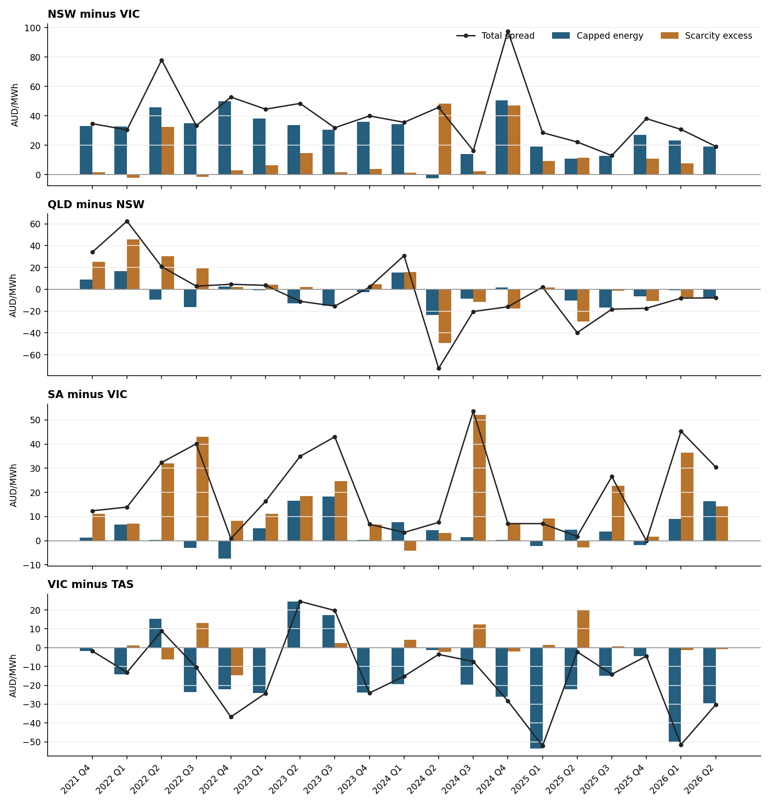

# Valuing interregional spreads and settlement residue units in the NEM

## Research purpose and the answer for the desk

Prepared for the IC Flow Forecasting project as version 2 of the 18 September 2026 research. It responds in full to the review in `reports/interregional_valuation_research_20260918/review.md`.

- **Market:** Australian National Electricity Market.
- **Units:** prices in AUD per MWh unless stated; settlement residue auction (SRA) prices and payoffs in AUD per unit per quarter.
- **Time:** fixed NEM time (UTC+10), interval-ending five-minute timestamps.
- **Evidence window:** {{intervals}} five-minute intervals, {{first_quarter}} to {{last_quarter}}, which is {{complete_quarters}} complete quarters.

Every number in this document is generated from the evidence files in `evidence/` by the build. None is typed by hand.

Version 1 designed a valuation. Version 2 carries it out on history, and it answers the desk's question directly.

**SRA units have been cheap relative to what they paid.** Across {{auction_tranches}} auction tranches whose delivery quarter has settled, holders received {{auction_ratio}} times the clearing price, weighted by units sold. The 95% interval is {{auction_ratio_lo}}–{{auction_ratio_hi}}, from a cluster bootstrap over delivery quarters. Realised payoff exceeded the price in {{auction_share_above}} of tranches. The discount grows with time to delivery:

| Sold ahead of delivery | Realised ÷ price | 95% interval |
|---|---:|---|
| 1–2 quarters | {{ratio_h12}} | {{ratio_h12_lo}}–{{ratio_h12_hi}} |
| 9–12 quarters | {{ratio_h912}} | {{ratio_h912_lo}}–{{ratio_h912_hi}} |

Auction proceeds were {{proceeds_total}} against {{distributed_total}} distributed to the holders of the units sold. Consumers, through their transmission networks, therefore received {{proceeds_share}} of the value they sold.

**The auction price is still the best available forecast of the payoff.** Scored at every auction date with only information available then, the clearing price had a mean absolute error of {{wf_mae_market_clearing_price}} per unit. The best rule built from settled history had {{wf_mae_trailing_4q}}. The clearing price was biased low by {{wf_bias_market_clearing_price}}. Auction prices therefore contain real information and a systematic discount; the discount is a premium, not ignorance. It is consistent with the transmission-right literature for New York [R11], US FTR auctions [R12–R14] and European long-term rights [R4]. Part of it may be the market pricing regime change, which Chapter 12 addresses.

**An SRA unit is not a futures spread, and the difference depends on direction.** Against a 1 MW flat futures-style spread position, over {{hedge_weeks}} full weeks:

| Unit | Min-variance units per MW | Variance of 1 MW spread removed | MW per unit (regression, $1/n^{*}$) | MW-equivalent, ten highest-spread weeks |
|---|---:|---:|---:|---:|
| VICNSW | {{hedge_mv_VICNSW}} | {{hedge_vr_VICNSW}} | {{hedge_mwpu_VICNSW}} | {{hedge_ratio_top_VICNSW}} |
| VICSA | {{hedge_mv_VICSA}} | {{hedge_vr_VICSA}} | {{hedge_mwpu_VICSA}} | {{hedge_ratio_top_VICSA}} |
| QLDNSW | {{hedge_mv_QLDNSW}} | {{hedge_vr_QLDNSW}} | {{hedge_mwpu_QLDNSW}} | {{hedge_ratio_top_QLDNSW}} |

The hedge weakens in exactly the weeks it is needed.

**The loop rule changes who is paid.** Applying the AEMC net-trade rule to settled history, holding dispatch fixed:

- VICNSW's payout pool changes by {{loop_change_VICNSW}}.
- SAVIC's changes by {{loop_change_SAVIC}}.
- The new NSW–SA and SA–NSW categories receive {{loop_new_categories}}.
- {{loop_pass_through}} of intervals have Victoria as a pass-through region.

Historical per-unit values for the VIC-connected units cannot be carried into quarters from November 2026 without adjustment.

**Futures are the missing leg.** The public AER futures series is {{futures_observed}} in this build: the AER website refuses automated retrieval. The futures premium and futures-scaled valuation chapters are built and run as soon as the chart exports are placed in `data/external/aer_futures/`. The capped-energy and scarcity market decomposition of Chapter 3 still needs $300 cap quotes, which AER data do not include.

The recommendation of version 1 stands. Value spreads and SRA units on a joint scenario model with a separate contract-settlement layer. Keep a physical distribution distinct from a market-calibrated one. Version 2 adds the empirical anchor that the design lacked: a reconciled settlement ledger, an auction-by-auction premium history and direction-specific hedge ratios.

{{include_v1 "## 1 The questions the model must answer" "## 1 The questions the model must answer"}}

## 2 Instruments and the object being valued

Let $A$ be the origin region and $B$ the destination. The signed spot spread is $S_t = P_{B,t} - P_{A,t}$; a positive spread means the destination is dearer. A long spread position is long the destination regional future and short the origin regional future, with matched hours and MW.

With interval length $\Delta t$ (one twelfth of an hour) and quarter length $H=\sum_t \Delta t$, the settlement quantities are:

$$
\bar P_r=\frac{1}{H}\sum_t \Delta t\,P_{r,t},\qquad
\bar C_r=\frac{1}{H}\sum_t \Delta t\,\max(P_{r,t}-K,0),\qquad K=300 .
$$

A flat $m$ MW long spread bought at forward spread $F_B-F_A$ has terminal profit, before funding and costs:

$$
\Pi^{\text{fut}} = m\,H\left[(\bar P_B-\bar P_A)-(F_B-F_A)\right].
$$

A pre-loop SRA unit on direction $A\to B$ with unit proportion $\theta$ pays:

$$
\Pi^{\text{SRA}} = \theta\sum_{t\in Q}\max\!\left(R^{A\to B}_t,0\right) - \text{price} - \text{fees},
$$

where $R^{A\to B}_t$ is the settled inter-regional residue of the directional interconnector (Chapter 6). The first payoff is linear in a time-weighted spread. The second is a sum of positive parts of a flow-weighted, loss-adjusted spread.

{{include_v1 "## 2 Instruments and the object being valued" "### 2.1 Instrument notes carried from version 1"}}

## 3 The exact energy, scarcity, loss and congestion decomposition

### 3.1 Energy and scarcity

For each regional price define

$$
E_{r,t}=\min(P_{r,t},K),\qquad C_{r,t}=\max(P_{r,t}-K,0),\qquad P_{r,t}=E_{r,t}+C_{r,t}.
$$

The spread then splits exactly:

$$
S_t=\underbrace{(E_{B,t}-E_{A,t})}_{\text{capped energy}}+\underbrace{(C_{B,t}-C_{A,t})}_{\text{scarcity excess}} .
$$

The same identity holds for quarterly means because the averaging operator is linear. Negative prices stay in the energy term, and at exactly $300 the excess is zero. The first $300 of a spike stays in energy. This is not the same as averaging only the sub-$300 intervals, which would change the sample whenever spike frequency changes.

The market analogue uses base futures $F_r$ and $300 cap futures $G_r$ on matched quarters and timestamps:

$$
F_B-F_A=\underbrace{(F_B-G_B)-(F_A-G_A)}_{\text{market capped-energy spread}}+\underbrace{(G_B-G_A)}_{\text{market scarcity spread}} .
$$

### 3.2 Four joint price states

Let $z_t\in\{\text{neither},\text{destination only},\text{origin only},\text{both}\}$ classify each interval by which regions exceed $K$. State contributions use all quarter hours as the denominator, so they sum to the quarterly mean:

$$
\bar S=\sum_{z}\frac{1}{H}\sum_t\Delta t\,S_t\,\mathbf 1\{z_t=z\}=\sum_z \Pr(z)\,\mathbb E[S\mid z].
$$

### 3.3 Loss and congestion (new in version 2)

In any interval where the interconnector does not bind, AEMO's dispatch sets the importing region's price at the exporting region's price times the interconnector's marginal loss factor $\lambda_t$ (the `MARGINALLOSS` field). Define the coupled reference price $P^{*}_t=\lambda_t P_{\text{from},t}$. The spread then splits exactly into a loss part and a congestion part:

$$
P_{\text{to},t}-P_{\text{from},t}=\underbrace{(P^{*}_t-P_{\text{from},t})}_{\text{loss part}}+\underbrace{(P_{\text{to},t}-P^{*}_t)}_{\text{congestion part}} .
$$

Applying the $K$ operator to each piece gives the $2\times2$ decomposition used in Exhibit N8:

$$
\text{energy loss}=\min(P^{*},K)-\min(P_{\text{from}},K),\qquad
\text{energy congestion}=\min(P_{\text{to}},K)-\min(P^{*},K),
$$

The scarcity pieces are the remainders. All four sum to the spread.

The loss part matters for relative value. A futures spread carries it in full. In a coupled interval with quadratic losses $L=kF^2$, the settlement residue earns only about $P\,L$, roughly half of $F\,(P^{*}-P_{\text{from}})$. Chapter 10 measures it.

## 4 The evidence base, {{first_quarter}} to {{last_quarter}}

Version 1 used three event datasets covering two years (seven complete quarters). The repository already held more. Version 2 rebuilds the evidence from the project's AEMO MMS dispatch tables, back-filled to October 2021 (the start of five-minute settlement) and covering all five regions and all six interconnectors. The resulting panel has {{intervals}} intervals with no missing prices or flows and no conflicting price versions.

Every interval in a complete quarter has `PRICE_STATUS = FIRM`; there are {{not_firm_complete}} non-firm rows there. The ported version 1 script reproduces the version 1 CSVs bit-for-bit on the version 1 window. That is a regression test in `nemic.valuation.baseline`.

Price flags are now decoded using AEMO's data model [R2]. Over the window there are:

- {{apc_binding_rows}} regional rows with the administered price cap or floor binding (APCFLAG bit 1);
- {{mpc_binding_rows}} with the market price cap or floor binding (bit 4);
- {{irlf_rows}} with inter-regional loss factor price scaling (bit 16);
- {{suspension_rows}} with a non-zero market-suspension flag, including the June 2022 suspension.

Version 1 described its flagged rows as "administered-price flags". They were cap-binding and price-scaling rows. Excluding suspension-flag intervals changes any pair's quarterly spread by at most \${{suspension_max_change}}/MWh.

### 4.1 Nineteen quarters of spreads

Exhibits 1–8 below now default to the full window, with a control to return to the version 1 window. Exhibit N13 shows all pairs and quarters, including VIC − TAS for the Basslink units that exist from July 2026.

| Pair (destination − origin) | Mean of quarters | Standard deviation | Lowest | Highest |
|---|---:|---:|---|---|
| NSW − VIC | {{mean_spread_nsw_vic}} | {{sd_spread_nsw_vic}} | {{min_spread_nsw_vic}} ({{minq_spread_nsw_vic}}) | {{max_spread_nsw_vic}} ({{maxq_spread_nsw_vic}}) |
| QLD − NSW | {{mean_spread_qld_nsw}} | {{sd_spread_qld_nsw}} | {{min_spread_qld_nsw}} ({{minq_spread_qld_nsw}}) | {{max_spread_qld_nsw}} ({{maxq_spread_qld_nsw}}) |
| SA − VIC | {{mean_spread_sa_vic}} | {{sd_spread_sa_vic}} | {{min_spread_sa_vic}} ({{minq_spread_sa_vic}}) | {{max_spread_sa_vic}} ({{maxq_spread_sa_vic}}) |
| VIC − TAS | {{mean_spread_vic_tas}} | {{sd_spread_vic_tas}} | {{min_spread_vic_tas}} ({{minq_spread_vic_tas}}) | {{max_spread_vic_tas}} ({{maxq_spread_vic_tas}}) |

### 4.2 How reliable is one quarter?

A realised quarter is one draw of weather, outages and bidding. For each complete quarter, a moving-block bootstrap resamples 7-day blocks of days with 2,000 replicates. The median width of the 95% interval for a quarter's mean spread is \${{boot_median_width}}/MWh (Exhibit N14).

Removing the single most influential day reverses the sign of the quarterly spread in {{sign_flips}} of {{pair_quarters}} pair-quarters (Exhibit N15). The most extreme case is {{frag_pair}} in {{frag_quarter}}: \${{frag_spread}}/MWh with every day, \${{frag_without}}/MWh without its largest day. Historical quarter means are therefore weak guides to a single future quarter. Valuation must be distributional.

## 5 SRA settlement mechanics and the 2026 transition

{{include_v1 "## 5 SRA settlement mechanics and the 2026 transition" ""}}

## 6 Realised SRA payoffs: the settlement ledger

### 6.1 From flow × spread to settled residue

For each physical asset $a$ with flow $F_{a,t}$ (positive from → to), losses $L_{a,t}$ and from-region loss share $s_a$ (AEMO `FROMREGIONLOSSSHARE`), the interval residue is:

$$
r_{a,t}=\frac{\Delta t}{1\,\text{h}}\Big[P_{\text{to},t}\big(F_{a,t}-(1-s_a)L_{a,t}\big)-P_{\text{from},t}\big(F_{a,t}+s_aL_{a,t}\big)\Big].
$$

A directional interconnector pools its regulated assets: VNI; QNI with Terranora; Heywood with Murraylink [R1]. Direction follows the sign of net flow. Before the loop rule, holders receive the positive part in each interval, and negative residue is recovered from the importing region's transmission network (NER 3.6.5(a)(4)) [R1]:

$$
R^{A\to B}_t=\sum_{a}r_{a,t}\,\mathbf 1\Big\{\sum_a F_{a,t}>0\Big\},\qquad
\text{payoff per unit}=\theta_Q\sum_{t\in Q}\max(R^{A\to B}_t,0).
$$

Here $\theta_Q$ is the unit proportion for the delivery quarter, from AEMO's `AUCTION_IC_ALLOCATIONS` table (for example, one VICNSW unit is 1/1,500 of the pool). For {{fallback_unit_rows}} early quarter-directions the table predates the download window, so the published maximum units are used.

### 6.2 Reconciliation to AEMO settlement

AEMO publishes settled residue per interconnector, region and interval (`SETIRSURPLUS`). The residue sits in the exporting region's row. Its flow and loss fields are metered interval energy in MWh, not dispatch targets.

Computed from metered flows with dated loss shares, the engine reproduces the settled positive residue to:

- {{rec_vni_north_metered}} on VNI northbound;
- {{rec_qni_south_metered}} on QNI northbound (QLD→NSW);
- {{rec_heywood_west_metered}} on Heywood VIC→SA.

It is {{rec_qni_north_metered}} away on QNI southbound (NSW→QLD), where counter-price and small reversed metered flows dominate. For realised payoffs the report therefore uses AEMO's settled residue directly. The computed engine is kept for sensitivities and for the loop counterfactual.

The version 1 proxy was lossless, positive-only, single-link and dispatch-based. Relative to settled payoffs it overstates:

| Direction | Lossless overstatement | Dispatch-flow difference | Metered-flow difference |
|---|---:|---:|---:|
| VICNSW | {{lossless_uplift_VICNSW}} | {{dispatch_vs_settled_VICNSW}} | {{metered_vs_settled_VICNSW}} |
| QLDNSW | {{lossless_uplift_QLDNSW}} | {{dispatch_vs_settled_QLDNSW}} | {{metered_vs_settled_QLDNSW}} |
| VICSA | {{lossless_uplift_VICSA}} | {{dispatch_vs_settled_VICSA}} | {{metered_vs_settled_VICSA}} |
| NSWQLD | {{lossless_uplift_NSWQLD}} | {{dispatch_vs_settled_NSWQLD}} | {{metered_vs_settled_NSWQLD}} |

### 6.3 What units paid

| Unit | Mean per quarter | Median | Lowest | Highest | Positive residue, all quarters | Negative residue recovered from TNSPs |
|---|---:|---:|---:|---:|---:|---:|
| VICNSW | {{pu_mean_VICNSW}} | {{pu_median_VICNSW}} | {{pu_min_VICNSW}} | {{pu_max_VICNSW}} | {{pos_total_VICNSW}} | {{neg_total_VICNSW}} |
| NSWVIC | {{pu_mean_NSWVIC}} | {{pu_median_NSWVIC}} | {{pu_min_NSWVIC}} | {{pu_max_NSWVIC}} | {{pos_total_NSWVIC}} | {{neg_total_NSWVIC}} |
| QLDNSW | {{pu_mean_QLDNSW}} | {{pu_median_QLDNSW}} | {{pu_min_QLDNSW}} | {{pu_max_QLDNSW}} | {{pos_total_QLDNSW}} | {{neg_total_QLDNSW}} |
| NSWQLD | {{pu_mean_NSWQLD}} | {{pu_median_NSWQLD}} | {{pu_min_NSWQLD}} | {{pu_max_NSWQLD}} | {{pos_total_NSWQLD}} | {{neg_total_NSWQLD}} |
| VICSA | {{pu_mean_VICSA}} | {{pu_median_VICSA}} | {{pu_min_VICSA}} | {{pu_max_VICSA}} | {{pos_total_VICSA}} | {{neg_total_VICSA}} |
| SAVIC | {{pu_mean_SAVIC}} | {{pu_median_SAVIC}} | {{pu_min_SAVIC}} | {{pu_max_SAVIC}} | {{pos_total_SAVIC}} | {{neg_total_SAVIC}} |

Basslink was a market network service provider until July 2026, so it has no SRA settlement history. Its historical spread and flow evidence is in Chapters 4 and 13.

## 7 Auction prices against realised payoffs

AEMO's public auction tables (`RESIDUE_PUBLIC_DATA`, `RESIDUE_CONTRACTS`, `AUCTION_TRANCHE`, `AUCTION_CALENDAR`) give every tranche's clearing price, units offered and sold, auction date and payment date. Each tranche was joined to the settled payoff of its delivery quarter, giving {{auction_tranches}} delivered tranches.

The value-weighted ratio for a set of tranches $\mathcal T$ is:

$$
\rho(\mathcal T)=\frac{\sum_{i\in\mathcal T} n_i\,\text{payoff}_i}{\sum_{i\in\mathcal T} n_i\,\text{price}_i},
$$

where $n_i$ is units sold. Confidence intervals resample delivery quarters rather than tranches, because every tranche of a quarter shares one realised outcome.

| Direction | Realised ÷ price | 95% interval |
|---|---:|---|
| VICNSW | {{ratio_VICNSW}} | {{ratio_VICNSW_lo}}–{{ratio_VICNSW_hi}} |
| NSWVIC | {{ratio_NSWVIC}} | {{ratio_NSWVIC_lo}}–{{ratio_NSWVIC_hi}} |
| QLDNSW | {{ratio_QLDNSW}} | {{ratio_QLDNSW_lo}}–{{ratio_QLDNSW_hi}} |
| NSWQLD | {{ratio_NSWQLD}} | {{ratio_NSWQLD_lo}}–{{ratio_NSWQLD_hi}} |
| VICSA | {{ratio_VICSA}} | {{ratio_VICSA_lo}}–{{ratio_VICSA_hi}} |
| SAVIC | {{ratio_SAVIC}} | {{ratio_SAVIC_lo}}–{{ratio_SAVIC_hi}} |

| Time to delivery | Realised ÷ price | 95% interval |
|---|---:|---|
| 1–2 quarters | {{ratio_h12}} | {{ratio_h12_lo}}–{{ratio_h12_hi}} |
| 3–4 quarters | {{ratio_h34}} | {{ratio_h34_lo}}–{{ratio_h34_hi}} |
| 5–8 quarters | {{ratio_h58}} | {{ratio_h58_lo}}–{{ratio_h58_hi}} |
| 9–12 quarters | {{ratio_h912}} | {{ratio_h912_lo}}–{{ratio_h912_hi}} |

Four explanations compete, and the evidence can partly separate them:

1. **Compensation for risk and capital.** Units are paid for up front and pay out over a quarter with extreme concentration (Chapter 4.2). Bidders are few, and the bid-to-offer ratio has a median of {{bid_to_offer}}. The horizon gradient fits a term premium.
2. **Regime and topology expectations.** Price declines for far tranches could reflect expected transmission build and the loop rule, which sold tranches could not observe ex post. The walk-forward test in Chapter 14 shows a systematic low bias even at short horizons. Expectations are unlikely to explain all of it.
3. **Proxy error.** Payoffs here are AEMO-settled, not modelled. Fees in the allocation table are zero for most quarters. This explanation is weak.
4. **Sample.** The window includes the 2022 energy crisis. Per-direction intervals are wide and sometimes include 1 (NSWVIC, SAVIC). The aggregate and the horizon gradient remain significant.

## 8 SRA units against futures spreads

### 8.1 Hedge effectiveness

The desk comparison is between a unit's payoff $U_w$ and the P&L of a 1 MW flat spread $S_w=\sum_{t\in w}\Delta t\,(P_{B,t}-P_{A,t})$, week by week. The minimum-variance number of units per MW of spread and its variance reduction are:

$$
n^{*}=\frac{\operatorname{Cov}(S_w,U_w)}{\operatorname{Var}(U_w)},\qquad
1-\frac{\operatorname{Var}(S_w-n^{*}U_w)}{\operatorname{Var}(S_w)}=\operatorname{Corr}(S_w,U_w)^2 .
$$

The stress MW-equivalent is $\sum_{w\in\text{top}}U_w\big/\sum_{w\in\text{top}}S_w$ over the ten weeks with the largest spread P&L.

| Unit | $n^{*}$ units per MW | Variance removed | Stress MW-equivalent |
|---|---:|---:|---:|
| VICNSW | {{hedge_mv_VICNSW}} | {{hedge_vr_VICNSW}} | {{hedge_ratio_top_VICNSW}} |
| QLDNSW | {{hedge_mv_QLDNSW}} | {{hedge_vr_QLDNSW}} | {{hedge_ratio_top_QLDNSW}} |
| VICSA | {{hedge_mv_VICSA}} | {{hedge_vr_VICSA}} | {{hedge_ratio_top_VICSA}} |
| NSWQLD | {{hedge_mv_NSWQLD}} | {{hedge_vr_NSWQLD}} | {{hedge_ratio_top_NSWQLD}} |
| NSWVIC | {{hedge_mv_NSWVIC}} | {{hedge_vr_NSWVIC}} | {{hedge_ratio_top_NSWVIC}} |
| SAVIC | {{hedge_mv_SAVIC}} | {{hedge_vr_SAVIC}} | {{hedge_ratio_top_SAVIC}} |

The mechanism is visible in the flows. When NSW is above $300, mean northward VNI flow is {{vni_flow_stress}} MW, against {{vni_flow_normal}} MW otherwise: the interconnector does not deliver more when it matters. On QNI, northward flow rises from {{qni_flow_normal}} MW to {{qni_flow_stress}} MW when NSW is scarce, and QLDNSW units hedge accordingly better.

Exhibit N12 turns this into a cost–risk frontier. A desk short 1 MW of spread buys units at each quarter's clearing price. The 95% conditional value at risk (CVaR) of the weekly loss $\ell$ is minimised over the number of units:

$$
\operatorname{CVaR}_{0.95}(\ell)=\min_{c}\Big\{c+\frac{1}{0.05}\,\mathbb E\big[(\ell-c)^{+}\big]\Big\}.
$$

This is the Rockafellar–Uryasev form. It is evaluated on a grid of unit holdings because there is only one instrument.

### 8.2 Futures premia (AER public data)

The AER series is {{futures_observed}} in this build (Exhibits N6–N7). When supplied, the ex-post premium for region $r$ and quarter $Q$ is:

$$
\pi^{\text{fut}}_{r,Q}=F_{r,Q}(\tau)-\bar P_{r,Q}
$$

This uses the last price $F_{r,Q}(\tau)$ observed before delivery. Spread premia are computed on matched pairs.

Published evidence finds positive, seasonal and cross-correlated premia in NEM base futures [R7], and significant risk premia in Nordic area-price spread contracts [R9, R10]. The SRA discount in Chapter 7 should be compared with those premia, per MW-equivalent, before concluding that one instrument is cheap against the other.

## 9 Why expected flow alone cannot determine value

The identity is:

$$
\mathbb E[F^{+}S^{+}]=\mathbb E[F^{+}]\,\mathbb E[S^{+}]+\operatorname{Cov}(F^{+},S^{+}).
$$

Version 1 computed the benchmark with a flow already gated by $\mathbf 1\{S>0\}$. That shared indicator adds a mechanical positive term:

$$
\operatorname{Cov}\big(F\mathbf 1\{S>0\},S^{+}\big)=\operatorname{Cov}(F^{+},S^{+})+\mathbb E[F^{+}]\,\mathbb E[S^{+}]\,\frac{1-\Pr(S>0)}{\Pr(S>0)}\ \ \text{(for independent $F$ and $S$).}
$$

On the version 1 window, VNI northbound's reported covariance of {{v1_cov_vninorth}} $/h falls to {{v1_ungated_vninorth}} $/h against the ungated benchmark. Conditional on a positive spread it is {{v1_condcov_vninorth}} $/h.

Version 2 reports rank dependence as well. For VNI northbound on the full window, the conditional Spearman correlation is {{full_condsp_vninorth}} while the conditional covariance is {{full_condcov_vninorth}} $/h. Flow and spread move together in ordinary intervals and apart in the extreme ones. That is precisely the firmness failure measured in Chapter 8.

{{include_v1 "## 6 Why expected flow alone cannot determine value" "### 9.1 Mechanism notes carried from version 1"}}

## 10 Loss-driven and congestion-driven spread

Over the full window, the average spread splits into:

| Pair | Loss part | Congestion part | Intervals coupled at the loss factor | Largest loss share in a quarter |
|---|---:|---:|---:|---:|
| NSW − VIC | {{loss_nsw_vic}} | {{cong_nsw_vic}} | {{coupled_nsw_vic}}% | {{loss_share_max_nsw_vic}} |
| QLD − NSW | {{loss_qld_nsw}} | {{cong_qld_nsw}} | {{coupled_qld_nsw}}% | {{loss_share_max_qld_nsw}} |
| SA − VIC | {{loss_sa_vic}} | {{cong_sa_vic}} | {{coupled_sa_vic}}% | {{loss_share_max_sa_vic}} |

The loss part is small on average but can dominate quiet quarters. It is also structural: it scales with flow (Exhibit N9) and with the price level. Basslink's prices almost never sit at its loss factor because, as a market network service provider (MNSP), it was dispatched on its own offers. VIC − TAS is therefore reported but not decomposed.

For valuation, a futures spread holds the whole loss part. An SRA holder earns the loss surplus $P\,L$ in coupled intervals, which is roughly half of it, plus the full congestion rent $F\,(P_{\text{to}}-P^{*})$ when separated.

## 11 Counter-price flows, negative residue management, constraints and outage plans

### 11.1 Counter-price residue

Negative settled residue totalled {{all_neg}} across all directions. {{all_forced_share}} of it arose while the interconnector was forced: a negative export limit or positive import limit pushed flow toward the cheaper region.

NSW→VIC alone carried {{nswvic_neg}}:

- {{nswvic_forced_share}} of it under forced southward flow;
- {{nswvic_exp300_share}} while NSW was above $300;
- negative-residue management (NRM) was active in {{nswvic_nrm_intervals}} intervals (flags from `NEGATIVE_RESIDUE`, available from August 2024).

Pre-loop, these amounts are recovered from the Victorian network and never reach unit holders. Under the loop rule, negative net loop residue is netted before payment, and NRM clamps only when the net loop residue is negative [R5]. Forced counter-price flow in NSW scarcity therefore becomes a direct risk to VIC-side units.

### 11.2 Which constraints separate the regions

The congestion part of each spread is attributed to the constraint AEMO reports as setting the binding interconnector limit. It is classified by AEMO's naming convention: `>>` thermal, `^^` voltage stability, `::` transient stability, and `NIL` for system-normal equations.

For NSW − VIC, the average congestion contribution splits into:

- transient stability, \${{vni_cong_transient}}/MWh;
- thermal, \${{vni_cong_thermal}}/MWh;
- voltage stability, \${{vni_cong_voltage}}/MWh.

By network state it is \${{vni_cong_system_normal}}/MWh for system-normal equations against \${{vni_cong_outage}}/MWh for outage and other equations. This naming heuristic is stated as such; the constraint-coefficient work in the NOS campaign is the rigorous companion.

### 11.3 Were outage plans informative before the auction?

For each delivery quarter from 2023 Q1, the analysis counts constraint-set hours already submitted to AEMO before the quarter's tranche-12 notification date, using the NOS campaign's outage-to-set mapping. The Spearman correlations with the realised share of separated intervals, over {{outage_quarters}} quarters, are:

| Pair | Spearman correlation |
|---|---:|
| NSW − VIC | {{outage_rho_nsw_vic}} |
| QLD − NSW | {{outage_rho_qld_nsw}} |
| SA − VIC | {{outage_rho_sa_vic}} |
| VIC − TAS | {{outage_rho_vic_tas}} |

Positive correlations mean known outages were an information source available at the auction. With only {{outage_quarters}} quarters this is suggestive, not proof.

## 12 The loop rule applied to history

The AEMC's final rule (ERC0386, 25 September 2025) settles the NSW–SA–VIC loop on net trade [R19]. For a net-positive loop interval:

1. The net loop residue is the sum of the arm allocations.
2. Net regional exports $x_r$ determine which arms carry net trade $q_k$, from net exporters to net importers.
3. The residue is then distributed in two steps:

$$
a_k=q_k\,(P_{\text{imp}(k)}-P_{\text{exp}(k)}),\qquad
\tilde a_k=R^{\text{loop}}\frac{a_k}{\sum_j a_j},\qquad
\text{payout}_k=R^{\text{loop}}\frac{\max(\tilde a_k,0)}{\sum_j\max(\tilde a_j,0)} .
$$

If the net loop residue is not positive, units receive nothing and it is recovered from networks by regional demand. The implementation passes the determination's Figure 3.1 and Appendix B Example 4 as unit tests.

Holding settled allocations and flows fixed from October 2021 to June 2026 gives a rule-only counterfactual:

| Unit category | Existing rules | Net-trade rule | Change |
|---|---:|---:|---:|
| VICNSW | {{loop_sq_VICNSW}} | {{loop_new_VICNSW}} | {{loop_change_VICNSW}} |
| NSWVIC | {{loop_sq_NSWVIC}} | {{loop_new_NSWVIC}} | {{loop_change_NSWVIC}} |
| VICSA | {{loop_sq_VICSA}} | {{loop_new_VICSA}} | {{loop_change_VICSA}} |
| SAVIC | {{loop_sq_SAVIC}} | {{loop_new_SAVIC}} | {{loop_change_SAVIC}} |
| NSWSA | — | {{loop_new_NSWSA}} | new |
| SANSW | — | {{loop_new_SANSW}} | new |

Victoria is a pass-through region in {{loop_pass_through}} of intervals. Secondary netting applies in {{loop_secondary}}. The loop is net negative in {{loop_net_negative}}.

EnergyConnect will change dispatch as well as settlement, so this is a lower bound on the structural break, not a forecast. It shows that value per VIC-side unit falls under the new rule even with unchanged physics.

## 13 Market settings, time of day and extremal dependence

**Market settings.** Intervals at the market price cap are rescaled to the FY2027 cap of {{mpc_target}} from AEMO's `MARKET_PRICE_THRESHOLDS`. That changes a quarter's scarcity component by at most \${{mpc_max_uplift}}/MWh (Exhibit N21). A forward valuation should load the delivery-year cap and cumulative price threshold, not the historical mix.

**Time of day.** Hour-by-season profiles (Exhibit N22) separate the midday renewable-surplus regime, where negative prices and export congestion sit, from the evening ramp, where scarcity and import limits coincide.

**Extremal dependence.** The cross-regional extremogram (Exhibit N16) estimates:

$$
\Pr\big(P_{j,t+h}>K\mid P_{i,t}>K\big)
$$

It measures common spikes at lag 0 and their persistence, the dependence the joint scenario model must reproduce [S19].

## 14 Valuation benchmarks and measured sensitivities

**Walk-forward baselines.** At each of {{wf_n}} tranche–direction auctions with a settled delivery quarter, frozen rules forecast the payoff per unit using only quarters settled at least 28 days before the auction:

| Rule | Mean absolute error | Bias |
|---|---:|---:|
| Clearing price | {{wf_mae_market_clearing_price}} | {{wf_bias_market_clearing_price}} |
| Trailing 4 quarters | {{wf_mae_trailing_4q}} | {{wf_bias_trailing_4q}} |
| Trailing 8 quarters | {{wf_mae_trailing_8q}} | {{wf_bias_trailing_8q}} |
| Trailing 12 quarters | {{wf_mae_trailing_12q}} | {{wf_bias_trailing_12q}} |
| Same season | {{wf_mae_same_season}} | {{wf_bias_same_season}} |
| Last quarter | {{wf_mae_last_quarter}} | {{wf_bias_last_quarter}} |

Any model proposed in Chapters 19–26 must beat the clearing price on identical tranches. A futures-scaled rule is added automatically when AER data exist.

**Spread-option benchmark.** Treating each interval as a Bachelier call on the spread gives:

$$
\mathbb E[S^{+}]=\sigma\,\varphi(\mu/\sigma)+\mu\,\Phi(\mu/\sigma)
$$

This is applied within season × 4-hour × flow-direction regimes and multiplied by the regime's mean flow. It overstates realised payoffs by a factor of {{option_overstatement}} out of sample (Exhibit N25). The independence assumption is the error: within-regime flow collapses when spreads spike. Margrabe's lognormal exchange-option formula [R17] is not usable here because regional prices are often negative.

**Scenario registry.** `evidence/scenario_registry.json` dates the loop settlement start, Basslink regulation, every unit-count change found in AEMO's allocation table, and announced transmission projects. Project timelines are marked "announced" and are unverified. Exhibit N24 shows how an eight-quarter baseline value moves under each measured alternative: flow definition, loss share, lossless residue and the loop rule.

## 15 Auction microstructure and returns

Public bid stacks (`RESIDUE_PRICE_FUNDS_BID`) show a median bid-to-offer ratio of {{bid_to_offer}}. {{unsold_share}} of units offered went unsold across the window (Exhibit N26).

Paying the clearing price on the calendar payment date and receiving weekly distributions with an assumed 21-day settlement lag gives:

- a median holding-period return of {{hpr_median}} per tranche;
- a loss in {{hpr_share_loss}} of tranches;
- about {{days_to_cash}} days to the value-weighted mean cash receipt.

Annualised figures are reported in the CSV but not headlined, because compounding a seven-week holding exaggerates them.

## 16 Strategic behaviour at interconnector limits (pilot)

On the highest-separation days per importing region ({{strategic_regions}}; {{strategic_intervals}} intervals), the price rise needed to call a further 200 MW of energy offers above the cleared stack has these medians, in \$/MWh: {{strategic_by_region}}. The regions point in opposite directions. This measures offer-curve steepness; it does not identify intent. A full study would need all days, rebid timing and portfolio positions [R16].

{{include_v1 "## 7 Triggers and how to establish their importance" "## 17 Triggers and how to establish their importance"}}

## 18 What academic research contributes

{{include_v1 "## 8 What academic research contributes" ""}}

### 18.1 Transmission-right auction pricing (new in version 2)

The closest analogue to the Chapter 7 result is the literature on centrally auctioned transmission rights:

- **New York.** Transmission congestion contracts cleared systematically below realised congestion payoffs, transferring value from ratepayers to financial participants [R11]. Siddiqui and co-authors raised efficiency concerns earlier.
- **Mechanism design.** Price formation in FTR auctions depends on bid-quantity limits and simultaneous feasibility, which can separate clearing prices from expected payoffs even with good forecasts [R12–R14].
- **Europe.** Long-term transmission right prices have fallen short of forward-market price spreads [R4].
- **Nordic area-price contracts.** The Nordic CfD (EPAD) literature finds significant risk premia in exchange-traded spread contracts [R9, R10].
- **NEM futures.** Positive, seasonal risk premia exist in NEM futures [R7]. Australian hedging practice is surveyed in [R8].

The AEMC's consultant review of the SRA confirms the pooling of parallel links and the pre-loop treatment of negative residue. It also questions whether excluding negative residue improves hedging [R1].

{{include_v1 "## 9 The recommended model architecture" "## 19 The recommended model architecture"}}

{{include_v1 "## 10 Forecasting a quarter rather than extending a short forecast" "## 20 Forecasting a quarter rather than extending a short forecast"}}

{{include_v1 "## 11 Forecasting the energy component" "## 21 Forecasting the energy component"}}

{{include_v1 "## 12 Forecasting scarcity occurrence duration and severity" "## 22 Forecasting scarcity occurrence duration and severity"}}

## 23 Turning forecasts into a market comparison

Keep two distributions. The physical distribution $\mathbb P$ is the best forecast of outcomes. A pricing distribution $\mathbb Q^{*}$ is one set of scenario weights consistent with quotes. Markets are incomplete, so $\mathbb Q^{*}$ is not unique. For a future, the estimated premium is the quote minus the physical expected settlement. For an SRA unit, it is the discounted physical expected payoff minus price and fees.

For a partially delivered quarter with elapsed fraction $w$ and realised average $\bar P^{\text{elapsed}}$, the market-implied remaining average is:

$$
\bar P^{\text{remaining}}=\frac{F-w\,\bar P^{\text{elapsed}}}{1-w}.
$$

The same formula applies to cap excess.

For a cap priced at $G$ with an assumed mean excess $m$ during scarcity, the pricing-weighted scarcity hours are:

$$
h=\frac{H\,G}{m},
$$

For example, $H=2{,}160$, $G=12$ and $m=4{,}000$ give $6.48$ hours. The same price fits many frequency–severity pairs, and a cap spread $G_B-G_A$ does not identify destination-only probability. The workbench below computes both the destination-cap and cap-spread versions.

Entropy pooling reweights physical scenarios $p_s$ to $q_s$, subject to pricing constraints on payoffs $X_s$ [S26]:

$$
\min_{q}\sum_s q_s\log\frac{q_s}{p_s}\quad\text{s.t.}\quad q_s\ge0,\ \ \sum_s q_s=1,\ \ \Big|\sum_s q_sX_{k,s}-\text{quote}_k\Big|\le\text{half-spread}_k .
$$

Calibrate to base and cap quotes and hold SRA prices out as a test. Monitor the effective scenario count, $1/\sum_s q_s^2$.

## 24 Comparing SRA prices with futures prices

A unit price is not a $/MWh spread. The conversion needs the unit proportion $\theta$, the quarter length $H$ and an effective positive-spread flow $\bar F$:

$$
\text{required flow-weighted spread}=\frac{\text{price}}{\theta\,H\,\bar F}.
$$

For example, with $\theta=1/1{,}500$, $H=2{,}160$ and $\bar F=500$ MW, a $15,000 price requires $20.83/MWh. Chapter 8 replaces the assumed $\bar F$ with the measured hedge ratio $n^{*}$, the number of units that best replicate one MW of spread. The empirical relative-value statement is therefore:

$$
\text{SRA cost per MW-equivalent}=n^{*}\times\text{clearing price}\quad\text{vs}\quad H\times(\text{futures spread}),
$$

together with the stress ratio in Exhibit N11, which shows how much of that equivalence survives in the weeks that matter.

{{include_v1 "## 15 Data architecture and source requirements" "## 25 Data architecture and source requirements"}}

{{include_v1 "## 16 Validation that reflects the trading objective" "## 26 Validation that reflects the trading objective"}}

## 27 A worked quarterly valuation example

These numbers are illustrative, not current quotes. Take a 90-day quarter ($H=2{,}160$) with destination NSW and origin VIC. The physical expectations are capped-energy prices of $85 and $65 and cap excesses of $18 and $8. The market quotes are base futures of $110 and $76 and caps of $25 and $9.

| Quantity | Physical expectation | Market | Market − physical |
|---|---:|---:|---:|
| Base spread $F_B-F_A$ | 30 | 34 | +4 |
| Cap spread $G_B-G_A$ | 10 | 16 | +6 |
| Capped-energy spread | 20 | 18 | −2 |

Buying the capped-energy combination (long NSW base, short NSW cap, short VIC base, long VIC cap) has expected terminal P&L $2\times2{,}160=4{,}320$ dollars per MW before costs and funding.

For an SRA illustration, take a hypothetical direction with $\theta=1/1{,}500$ and an expected distributable residue of $30m. The expected payoff is $20,000 per unit against a $15,000 price, a $5,000 undiscounted margin. Chapter 7 shows that realised history has delivered margins of this kind on average, with wide dispersion and a strong horizon gradient.

{{include_v1 "## 18 Portfolio use and instrument selection" "## 28 Portfolio use and instrument selection"}}

## 29 Integration with the existing IC project

{{include_v1 "## 19 Integration with the existing IC project" ""}}

Version 2 implements the suggested modules as `nemic/valuation/` (config, acquisition, panel, baseline, settlement, loop, evidence, market, mechanisms, valuation tests, summary), driven by `configs/valuation/interregional_valuation_v2.json` and run with `python -m nemic.valuation <stage>`. It is a research stack, separate from the forecasting campaigns and the production scaffold.

{{include_v1 "## 20 Research programme and deliverables" "## 30 Research programme and deliverables"}}

Status at version 2: Stage 1 (ledger and reconciliation) is complete. Stage 4 is complete on the auction side and waits on futures data. Stages 2, 3 and 5 remain as designed.

{{include_v1 "## 21 The quarterly decision document" "## 31 The quarterly decision document"}}

## 32 Evidence limits and unresolved questions

- **Futures.** No futures or cap quotes are in this build. The SRA-versus-futures relative value is therefore measured as hedge equivalence and SRA premia, not as a joint premium comparison.
- **Loop counterfactual.** It holds dispatch fixed. EnergyConnect will change flows.
- **Constraint attribution.** It uses AEMO's naming convention, not equation coefficients.
- **Strategic analysis.** It is a pilot.
- **Early unit counts.** For {{fallback_unit_rows}} early quarter-directions, unit proportions use published maxima.
- **Auction premium drivers.** The auction premium's decomposition into risk, capital and expectations is not identified. The open question is whether the discount persists in quarters settled under the loop rule.

## 33 Sources and reading guide

{{include_v1 "## 23 Sources and reading guide" ""}}

### Sources added in version 2

[R1] Cambridge Economic Policy Associates for the AEMC. Settlements Residue Auction and Modified Load Export Cost processes, final report, 24 May 2024. [Report](https://www.aemc.gov.au/sites/default/files/2024-06/cepa_report_-_sra_and_mlec.pdf). Directional interconnector pooling; treatment of negative residue; SRA structure.

[R2] AEMO. MMS Data Model Report, DISPATCHPRICE table. [Data model](https://visualisations.aemo.com.au/aemo/nemweb/MMSDataModelReport/Electricity/MMS%20Data%20Model%20Report_files/MMS_130.htm). APCFLAG bit definitions; RRP as the settlement price.

[R3] AEMO. Unit category data notices; MMS table AUCTION_IC_ALLOCATIONS. Maximum units and proportions per quarter and direction.

[R4] Stiewe, C. Arbitrage and rents in European long-term transmission rights. arXiv:2607.28790, July 2026. [Paper](https://arxiv.org/abs/2607.28790).

[R5] AEMO. Automation of Negative Residue Management (2021) and the consultation for transmission loops (2025). [Consultation](https://www.aemo.com.au/consultations/current-and-closed-consultations/automation-of-negative-residue-management-for-the-implementation-of-transmission-loops).

[R7] Handika, R. and Trück, S. Risk Premiums in Interconnected Australian Electricity Futures Markets. SSRN 2279945, 2013. [Paper](https://papers.ssrn.com/sol3/papers.cfm?abstract_id=2279945).

[R8] Flottmann, J. H., Wild, P. and Todorova, N. Derivatives and hedging practices in the Australian National Electricity Market. Energy Policy 189, 114114, 2024.

[R9] Marckhoff, J. and Wimschulte, J. Locational price spreads and the pricing of contracts for difference: evidence from the Nordic market. Energy Economics 31(2), 257–268, 2009.

[R10] Kristiansen, T. Pricing of Contracts for Difference in the Nordic market. Energy Policy 32(9), 1075–1085, 2004.

[R11] Leslie, G. Who benefits from ratepayer-funded auctions of transmission congestion contracts? Evidence from New York. Energy Economics, 2021. [Abstract](https://www.sciencedirect.com/science/article/abs/pii/S0140988320303650).

[R12] Opgrand, J., Preckel, P. V., Gotham, D. J. and Liu, A. L. Price formation in auctions for financial transmission rights. The Energy Journal 43(3), 2022.

[R13] Deng, S.-J., Oren, S. and Meliopoulos, A. P. The inherent inefficiency of simultaneously feasible financial transmission rights auctions. Energy Economics 32(4), 2010.

[R14] Adamson, S., Noe, T. and Parker, G. Efficiency of financial transmission rights markets in centrally coordinated periodic auctions. Energy Economics 32(4), 2010.

[R16] Joskow, P. and Tirole, J. Transmission rights and market power on electric power networks. RAND Journal of Economics 31(3), 450–487, 2000.

[R17] Margrabe, W. The value of an option to exchange one asset for another. Journal of Finance 33(1), 177–186, 1978.

[R18] Rockafellar, R. T. and Uryasev, S. Optimization of conditional value-at-risk. Journal of Risk 2(3), 21–41, 2000.

[R19] AEMC. Inter-regional settlements residue arrangements for transmission loops, rule determination ERC0386, 25 September 2025. [Determination](https://www.aemc.gov.au/sites/default/files/2025-09/Final%20determination-%20ERC0386.pdf). Net-trade method, secondary netting, loss treatment and worked examples used as tests.

[L05] Version 2 evidence. `nemic/valuation/*`, `evidence/*.csv` and `evidence/data_audit.json`: inputs, hashes, coverage and every computed table.

## Appendix A Formula reference

| Quantity | Definition |
|---|---|
| Quarterly average | $\bar X=\frac{1}{H}\sum_t\Delta t\,X_t$, with $H=\sum_t\Delta t$ |
| Energy and scarcity | $E=\min(P,K)$, $C=\max(P-K,0)$, $P=E+C$, $K=300$ |
| Frequency × severity | $\bar C=p\,m$, with $p=\Pr(P>K)$ and $m=\mathbb E[P-K\mid P>K]$ |
| State contribution | $\frac{1}{H}\sum_t\Delta t\,S_t\mathbf 1\{z_t=z\}$, which sums over $z$ to $\bar S$ |
| Loss / congestion | $S=(\lambda P_{\text{from}}-P_{\text{from}})+(P_{\text{to}}-\lambda P_{\text{from}})$ |
| Asset residue | $r=P_{\text{to}}(F-(1-s)L)-P_{\text{from}}(F+sL)$ per hour |
| Unit payoff (pre-loop) | $\theta_Q\sum_{t\in Q}\max\big(\sum_a r_{a,t},0\big)$ over intervals of net flow $A\to B$ |
| Auction ratio | $\rho=\sum_i n_i\,\text{payoff}_i\big/\sum_i n_i\,\text{price}_i$ |
| Hedge ratio | $n^{*}=\operatorname{Cov}(S_w,U_w)/\operatorname{Var}(U_w)$, variance removed $=\operatorname{Corr}^2$ |
| CVaR | $\operatorname{CVaR}_\alpha(\ell)=\min_c\{c+(1-\alpha)^{-1}\mathbb E(\ell-c)^{+}\}$ |
| Bachelier call | $\mathbb E[S^{+}]=\sigma\varphi(\mu/\sigma)+\mu\Phi(\mu/\sigma)$ |
| CRPS (ensemble) | $\frac1M\sum_i\lvert x_i-y\rvert-\frac{1}{2M^2}\sum_{i,j}\lvert x_i-x_j\rvert$ |
| Block bootstrap | $\bar S^{(b)}=\frac1D\sum_{d\in\mathcal B^{(b)}}\bar S_d$, with $\mathcal B^{(b)}$ contiguous 7-day blocks |
| Loop payout | $R^{\text{loop}}\max(\tilde a_k,0)/\sum_j\max(\tilde a_j,0)$ with $\tilde a_k=R^{\text{loop}}a_k/\sum_ja_j$ |

{{include_v1 "## Appendix B Research search and screening record" "## Appendix B Research search and screening record"}}

## Appendix C Response to the review

Each item from `review.md` is listed below with the action taken and where it now appears.

| Review item | Action in version 2 | Where |
|---|---|---|
| C-01 no futures, auction history or realised payouts | Settled payoff ledger; every delivered tranche joined to realised payoff; hedge-equivalence against a futures-style spread. AER futures loader built but not observed (AER blocks automated access). | Ch. 6–8, N1–N12 |
| M-01 gated covariance | Ungated and gate-conditional covariance and Spearman correlation; the Exhibit 9 caption is corrected. | Ch. 9, Exhibit 9 |
| M-02 lossless, dispatch flow, single link | Pooled, loss-adjusted, settled residue; reconciliation to SETIRSURPLUS. | Ch. 6, N1 |
| M-03 counter-price flows | Negative residue ledger, forced-flow and NRM tagging. | Ch. 11, N17 |
| M-04 sample length | 19 complete quarters, TAS added. | Ch. 4, N13 |
| M-05 loss vs congestion | Exact 2×2 decomposition and loss curves. | Ch. 3, 10, N8–N9 |
| M-06 no uncertainty | Block bootstrap, leave-one-day-out, extremograms. | Ch. 4.2, 13, N14–N16 |
| M-07 market price cap regime | Rescaled to the FY2027 cap from MARKET_PRICE_THRESHOLDS. | Ch. 13, N21 |
| M-08 unit counts | Dated unit registry from AUCTION_IC_ALLOCATIONS. | Ch. 6, `sra_unit_registry.csv` |
| M-09 literature | Transmission-right auction, EPAD and NEM futures premium literature added. | Ch. 18.1, sources |
| M-10 loop unquantified | Net-trade rule implemented, tested on AEMC examples, applied to history. | Ch. 12, N20 |
| m-01 flag labels | APCFLAG bits decoded. | Ch. 4 |
| m-02 revisions caveat | PRICE_STATUS audited. | Ch. 4, `data_audit.json` |
| m-03 selective table | Full tables and heatmap. | Ch. 4, N13 |
| m-04 flow input hash, run selection | All input folders hashed; physical-run selection documented. | `data_audit.json`, `nemic.valuation.panel` |
| m-05 trivial identity check | Replaced by v1 regression, reconciliation and identity tests. | `tests/test_valuation_*.py` |
| m-06 figure without code | `make_figures.py` generates Figure 1. | `make_figures.py` |
| m-07 manifest hashes | Line-ending-normalised hashes. | `report_manifest.json` |
| m-08 workbench defaults | Aligned with the §27 worked example. | Workbench |
| m-09 $10 minimum clause | Not verified; the SRA Rules PDF blocks automated access and is listed for manual download. | `data/external/README.md` |
| m-10 implied hours from destination cap only | Cap-spread version added to the workbench. | Workbench |
