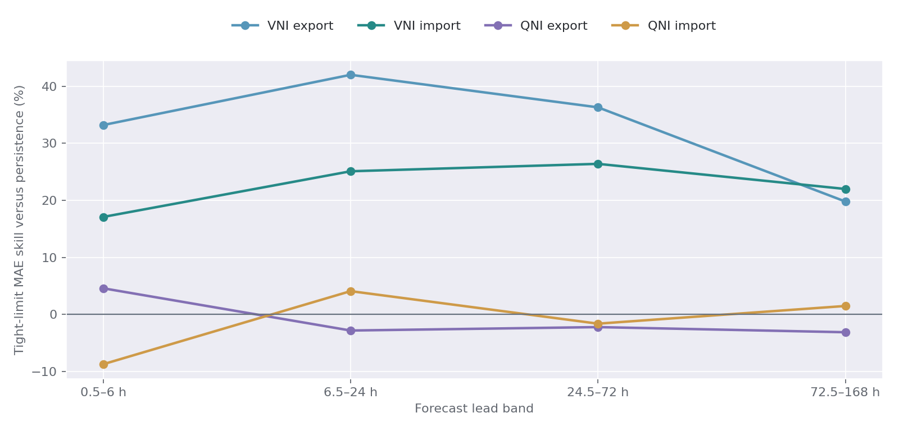
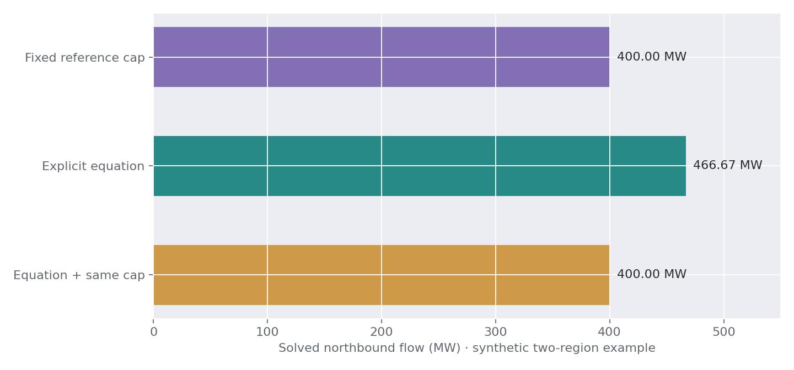
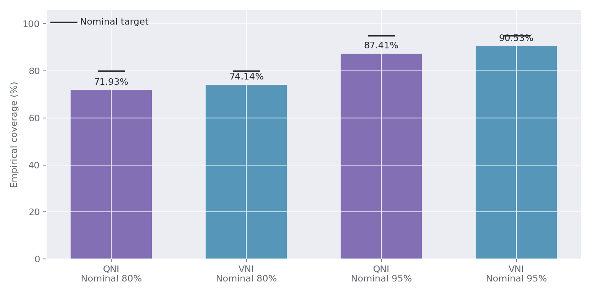

# From interconnector research to forward forecasts with NEMPy

**An end-to-end assessment of forecast limits, historical regimes and NOS outage scenarios**  
Prepared 4 October 2026 · IC FLOW FORECASTING · Design and research assessment

**Scope.** This report addresses the user's two priorities: the next seven days and the month ahead. It covers half-hour forecasts from 30 minutes to seven days and a distinct days 8–30 ensemble. QNI and VNI are the first research targets, inside a model of all five NEM regions. Market calculations use fixed NEM time, UTC+10, with interval-ending timestamps. The source studies mainly end in August 2026; the report date is not a refreshed market-data cutoff. Recommendations below are proposed experiments, not measured NEMPy forecast performance.

## 1. Recommendation

Your two ideas are complementary, but they solve different problems.

**First, build the simplified engine that uses forecast directional limits.** It is the quickest way to test whether the existing research improves forecasts of dispatch flow, regional price spreads and congestion. NEMPy chooses generation and flows within a forecast envelope; the statistical model supplies that envelope. Start with VNI, where the saved evidence is stronger, while allowing QNI to retain persistence, seasonal or matched AEMO forecasts wherever those win.

**Then develop a constraint-scenario engine.** Use NOS and historical regimes to forecast which network configurations and constraint equations are applicable, and to construct their future right-hand sides. Let NEMPy determine which of those equations actually bind. A booking is not an invocation; an invocation is not a binding event; and a constraint that sets a reported interconnector limit need not bind in dispatch.

**The preferred destination is a probabilistic hybrid with explicit ownership of each restriction.** Some restrictions will be represented by complete equations; other uncertainty will be represented by an empirical envelope or a separate model branch. Do not automatically impose the statistical limit and every equation that helped produce it. That can preserve the original dispatch assumptions after NEMPy has changed dispatch, unnecessarily restricting transfers.

The most useful framing is:

> Forecast the feasible operating conditions, then solve the market under those conditions. Use observed flows and binding outcomes to test the whole system.

The decisive first experiment is not whether NEMPy runs. It is whether replacing simple interconnector assumptions with the out-of-sample limit forecasts improves downstream forecasts on identical, genuinely issue-time inputs.

For the month ahead, build a separate days 8–30 scenario product using forward-known bookings and availability, seasonal operating distributions and coherent weather/demand paths. Its initial value is a calendar of transfer and spread risk, with weekly exposure summaries. A new extended-horizon model must earn its place against seasonal and outage-conditioned baselines; the seven-day bundles cannot simply be stretched to cover it.

## 2. What the existing findings justify

The three existing stacks retain separate identities: the original six-link conditional backtest, the newer QNI/VNI research campaigns, and the provider-neutral production scaffold. A result or saved package from one does not establish the performance or readiness of another.

| Evidence inspected | Finding | Consequence for this design |
|---|---|---|
| VNI diurnal/NOS v2 | Tight-export MAE skill versus persistence is 33.2%, 42.0%, 36.3% and 19.8% across its four lead bands; tight-import skill is 17.1%, 25.1%, 26.4% and 22.0% | VNI is the strongest initial candidate for the forecast-envelope experiment; these figures are limit scores, not flow or price scores |
| QNI diurnal/NOS v2 | Tight-export skill is 4.6%, −2.8%, −2.2%, −3.1%; tight-import skill is −8.7%, 4.1%, −1.6%, 1.5% | Keep routing connector-, direction- and horizon-specific; do not copy the VNI policy |
| Interval calibration | Delivery-period nominal 80% coverage is 74.14% for VNI and 71.93% for QNI; nominal 95% coverage is 90.53% and 87.41% | Existing bands are too narrow; recalibrate before interpreting scenario probabilities |
| NOS point-model additions | VNI source-common gains are mixed; QNI tight-export gain is 1.03%, with −0.40% for tight import | A blanket NOS adjustment is not supported; test conditional risk and mechanism improvements separately |
| NOS constraint mechanics | Median own-set limit-setting shares are 2.9% for QNI and 20.2% for VNI; median binding shares are 1.3% and 4.1% | Retain system-normal constraints during outages; do not assume the named outage equation takes over |
| NOS outlook | Beats the normal seasonal rate on Brier score in 23 of 96 cells; one well-populated bin forecasts 36% binding versus 15% realised | Apply shrinkage and cell-level eligibility; use unskilful outlooks as labelled scenarios, not probabilities |
| Missing booking-to-set links | Among bookings that subsequently invoked a set, the first inferred family was correct 19% of the time; top three reached 22% | Asset-name inference is too weak to select one hard constraint set automatically |

Sources: [VNI results](../../docs/VNI_DIURNAL_NOS_RESULTS.md), [QNI results](../../docs/QNI_DIURNAL_NOS_RESULTS.md), and [NOS mechanics/outlook summary](../../execution/nos_constraint_binding_v1/RESULTS_SUMMARY.md). The forecasting and descriptive outage studies use different populations and eligibility rules; their support counts are not interchangeable. The v2 matched audits found no supported recurring entity under their strict gates. That does not contradict the broader descriptive study's supported family-directions.



*Historical development evidence only. Four bands are 0.5–6, 6.5–24, 24.5–72 and 72.5–168 hours. Data: [compact evidence](evidence.csv).*

There are especially informative outage families. The NOS study reports QNI forward own-set binding shares of 82% for Armidale–Dumaresq, 81% for Armidale–Sapphire and 61% for Dumaresq–Sapphire. These are priorities for mechanism prototypes because they sometimes displace normal leaders. They are retrospective shares conditional on realised invocation, not the probability that a newly booked outage will bind.

Two newer evidence sets require care. The inspected clustering report contains a single pilot forecast comparison and no established forecast benefit; later connector execution summaries say their modelling stages completed, while a continuation status records a report-build failure. This report does not infer a completed validated clustering verdict from those mixed artifacts. Use [the cached clustering paper](../qni_vni_clustering_v1/Clustering_Research.md) as limited development evidence and reconcile the campaign before citing an aggregate uplift. The fundamentals-v3 assessment records also retain promotion/provenance restrictions; the [execution guide](../../execution/qni_vni_fundamentals_v3/README.md) governs that separate campaign. Neither is a shortcut to operational eligibility for the saved v2 bundles.

## 3. Define what you are forecasting

| Quantity | Meaning | Role in the new system |
|---|---|---|
| Signed dispatch flow | Transfer selected in the dispatch solution | Primary NEMPy output and forecast target |
| Reported directional limit | AEMO's dispatch-conditioned import/export result | Empirical forecast target; a possible reduced-form engine input |
| Conditional equation envelope | Bounds on one link after holding other equation terms fixed | Diagnostic and local sensitivity, not independent secure capability |
| Applicable or invoked equation | A restriction included for the network state | Input selected from issue-known information and scenarios |
| Binding equation | An applicable restriction active at the solution | Derived outcome; distinguish equality from economically material shadow value |
| Reported limit setter | Equation identified as setting a directional limit | Separate outcome from binding |
| Secure physical transfer capability | Security assessment under a specified network and contingency model | Not established by this project's reported-limit forecasts or a simplified NEMPy solve |

NEMPy is a dispatch optimisation toolkit. It can choose dispatch given market and constraint inputs; it does not independently supply tomorrow's weather, bids, outages or complete network-security calculations. The public introduction describes its modular dispatch features, while its historical tools reconstruct past intervals. Those tools are valuable for engine verification, but future realised NEMDE inputs cannot be used as issue-time forecast inputs. [NEMPy introduction](https://nempy.readthedocs.io/en/latest/intro.html), [historical input documentation](https://nempy.readthedocs.io/en/latest/historical.html).

This distinction also changes the output language. Early price outputs should be described as **conditional model prices**. A realistic network layer can still produce poor price forecasts if fuel offers, rebidding, unit commitment or battery behaviour are wrong.

## 4. Choose a product for each horizon

| Horizon | Useful product | Recommended representation | Main uncertainty |
|---|---|---|---|
| Next hour | Flow and constraint-transition nowcast | Five-minute state, ramps and short-horizon scenarios | Current availability, fast changes, receipt delay |
| 0.5–6 hours | Intraday flow, spread and congestion forecast | Forecast envelope plus detailed pilot equations | Dispatch state, bid response, imminent outage transitions |
| 6.5–24 hours | Day-ahead scenario distribution | Joint fundamentals and network-state scenarios | Demand/VRE, outage timing, unit availability and bidding |
| 24.5–72 hours | Risk ranges and likely congestion periods | Wider ensembles, regime transitions, fewer trusted equations | Weather, cancellations, changing generation patterns |
| 72.5–168 hours | Seven-day planning forecast | Calibrated broad scenarios and validated simple fallbacks | Model drift, outage combinations, increasingly uncertain supply |
| 8–14 days | Daily/peak-block flow, spread and outage-risk ranges | Extended forecast members where verified, blended with calibrated analog paths | Weather predictability, booking revisions and availability |
| 15–30 days | Week-by-week and delivery-block distributions of transfer/spread risk | Conditional weather/demand analogs, availability and booking ensembles | Weather regime, energy budgets, offer behaviour and outage duration |

The month-ahead product should report expected congested hours, directional restriction exposure, conditional spread distributions and sensitivity to bookings. Do not extend a seven-day bundle beyond its 336 half-hour leads. The existing NOS annual outlook may inform booking scenarios in the first month, but its calibration limitations persist and its historical skill does not establish month-ahead flow or price skill.

### 4.1 A concrete month-ahead design

Build a continuous 30-day scenario calendar with two explicitly different forecast contracts. Days 1–7 use the supported short-horizon models and available forecast products. Days 8–30 use a new research contract: forward-known calendar/topology/bookings, available generation forecasts, and joint demand/VRE/weather scenarios. Daily refresh should regenerate the calendar from a newly frozen origin; later receipt of an outage revision must never rewrite an earlier issued forecast.

Where a weather product genuinely supports days 8–14, preserve its original run and evaluate that horizon independently. Beyond verified skill/coverage, transition to conditional historical weather trajectories or a validated extended-range ensemble. Preserve regional covariance, hot/cold spells and renewable drought duration. Do not carry the last day of a seven-day weather forecast through the rest of the month. A seamless plotted curve is less important than an honest change in forecast basis.

Use published forward unit availability only over its actual delivery coverage and resolution. Daily availability can constrain a day's maximum available capacity, but cannot determine within-day dispatch or bid position. Draw unit outages, return-to-service uncertainty, hydro energy budgets and battery operation coherently across the month. If fuel/offer assumptions are uncertain, publish multiple named supply scenarios until their probabilities can be validated.

For the network, begin with season × delivery-period envelope distributions plus validated booking-state adjustments and supported equation scenarios. Learn these on earlier history and retain signed/forced-flow regimes. A separate 8–30-day statistical model can later condition on the same inputs; it must compete against this seasonal/outage baseline. The existing 41-column seven-day bundle is not that model.

Solve representative chronological day/week paths, or the full month where runtime permits. Preserve the start/end of outages and persistence of weather spells. Representative-day weights must recover the target month's calendar and outage exposure; sampling only ordinary days misses tails. Validate any scenario reduction against a larger reference ensemble, especially for scarcity, storage depletion and long outage overlaps.

Publish four layers: half-hour scenario trajectories for analysis; daily peak/off-peak summaries; weekly distributions; and month-level exposure. Aggregate each scenario first, then calculate quantiles across scenarios. An average of half-hour P90s is not the P90 of a monthly average. Retain a view of hours near binding and the probability of multi-day restricted transfer, because monthly mean flow can hide a commercially material outage week.

Score this as its own product at 8–14 and 15–30 days, with origin-balanced errors and month/week-level risk metrics. The handover at day 7 should be assessed for artificial jumps in level, variance and scenario dependence; do not smooth away a genuine booked outage. A forecast at the edge of the short-range model can initialise month-ahead scenarios without being held fixed for 23 further days.

The first useful month-ahead deliverable would be a 30-day QNI/VNI calendar showing baseline and booked-outage exposure, flow/spread ranges by delivery block, and the few bookings contributing most to uncertainty. Every interval should identify its forecast basis: short-range model, extended forecast, historical analog or analyst scenario.

## 5. Approach A: forecast limits inside a simplified NEMPy market

### 5.1 The structure

For each delivery interval, build regional supply offers and demand, model all material interregional routes, and constrain signed flow on each link using the selected lower and upper forecasts. NEMPy solves for flows and dispatch; it is not instructed to hit the statistical flow forecast.

Use all five regions even when scoring QNI/VNI. NSW connects those two research targets, while SA and Tasmania alter Victorian balance. Keep parallel routes separate: QNI/Directlink and Heywood/Murraylink are not single interchangeable pipes. Audit effective standing data for the forecast date rather than assuming the historical six-link topology remains complete forever.

A reduced regional supply stack is adequate for the first envelope experiment. Explicit generic equations involving particular DUIDs require those units, or a justified aggregation preserving their coefficients and feasible response. A generic regional supply block cannot substitute for a hydro unit with a distinctive network coefficient.

### 5.2 Correct signs and identities

The repository uses positive flow from the first region below to the second. Its import target is the negative of the raw signed `IMPORTLIMIT`.

| Link | Positive signed flow | Negative signed flow |
|---|---|---|
| QNI, `NSW1-QLD1` | NSW → Queensland: northbound | Queensland → NSW: southbound |
| VNI, `VIC1-NSW1` | Victoria → NSW: northbound | NSW → Victoria: southbound |

Let E be the forecast export target and I the forecast import target under the repository contract:

```text
upper signed bound U = E
lower signed bound L = -I
NEMPy link limits: min = L, max = U
```

Thus E = 800 and I = 500 means −500 ≤ F ≤ 800 MW. If I = −100, the lower bound is +100 MW: the state requires positive flow. Do not apply absolute values or clamp these signs to zero. If E = −50 and I = 500, the envelope is −500 ≤ F ≤ −50 MW, requiring negative flow. Sources: [preparation code](../../nemic/prepare.py) and [connector definitions](../../nemic/common.py).

### 5.3 Mean limits, tight limits and five-minute operation

The ordinary export/import targets are half-hour means. Tight targets are minima of the six five-minute directional observations. Neither supplies a unique path through those six intervals.

For a half-hour average-dispatch prototype, use the mean targets as the primary experiment, with tight targets as a distinct persistent-restriction stress scenario. Do not use tight limits for all six intervals and call the resulting prices an unbiased central forecast: that assumes the worst restriction persists throughout the half-hour.

There is a subtle feasibility trap. Tight bounds describe the intersection of all within-half-hour bounds, which can be empty even if every five-minute problem is feasible. For example, one interval permits +100 to +300 MW and a later interval permits −300 to −100 MW. The tight constant-flow envelope would have L = +100 and U = −100. That indicates an inability to maintain one constant flow through the half-hour, not necessarily corrupt observations. Separate this case from independently predicted bounds that cross through model error.

For meaningful five-minute price spikes, ramps and forced-direction changes, develop a five-minute target or a calibrated joint path model conditioned on half-hour forecasts. Verify that averaging/minimising the generated paths recovers the intended target definitions. A 30-minute solver setting changes ramp interpretation; it does not reproduce six five-minute dispatches or their price distribution.

### 5.4 Strengths and limits

This approach directly reuses measured predictive structure, is comparatively easy to audit, and provides a strong benchmark for more complex physics. It also makes attribution straightforward: change the envelope while holding all other forecast inputs constant.

Its central weakness is endogeneity. A reported limit summarises a solution in which generation, other links and non-market measurements already had particular values. If the forward engine changes those values, that reported limit may no longer describe the appropriate restriction. Independent QNI/VNI boxes also omit coupled inequalities such as a weighted sum of flows and generation. Individually plausible bounds therefore need not imply a jointly realistic network solution.

The envelope engine can still be a useful predictive approximation. Its credibility must come from downstream forecast tests, with a narrower interpretation than a counterfactual network-security model.

## 6. Approach B: forecast the constraint scenario, solve for binding

### 6.1 The complete chain

```text
Issue-known NOS booking and revisions
  → probability and timing of actual outage
  → applicable network configuration and candidate constraint sets
  → effective equation versions and complete LHS coefficients
  → future RHS values / scenarios
  → NEMPy dispatch under forecast fundamentals and offers
  → flow, prices, constraint slack and economic binding outcomes
```

AEMO describes sets as a mechanism for activating equations for network conditions. Its distinction between dispatchable LHS quantities and precomputed RHS quantities is essential here: RHS can depend on measurements, ratings and states outside the market optimisation. It cannot generally be inferred just from an equation name. [AEMO constraint FAQ](https://www.aemo.com.au/energy-systems/electricity/national-electricity-market-nem/system-operations/congestion-information-resource/constraint-faq).

For a normalised inequality:

```text
sum_j a_j F_j + sum_g b_g P_g + sum_s c_s FCAS_s <= R
```

NEMPy should choose F, P and the included ancillary-service variables jointly. If all other terms are fixed, the conditional bound for a link with a positive coefficient is:

```text
F_j <= (R - sum_g b_g P_g - other terms) / a_j
```

A negative coefficient gives a lower signed-flow bound after reversing the inequality. Preserve the original inequality direction or explicitly normalise it; equality constraints need their own treatment. Very small interconnector coefficients make derived bounds numerically unstable and need a declared tolerance.

### 6.2 Do not predict just one winner

Construct a candidate pool from known scheduled sets, relevant normal sets, likely alternatives, runner-up equations and supported overlaps. Include applicable equations even when their estimated binding probability is low: a low-frequency equation may dominate a rare high-impact scenario. Top-K ranking is a computational screen, not permission to omit a known applicable restriction.

Use a calibrated classifier to prioritise candidates, generate uncertain topology scenarios and flag unfamiliar states. It should not force an equation to bind by replacing its inequality with equality. Dispatch economics decides whether headroom is used.

For model-reduction research, solve with the shortlist, then check the solution against the fuller eligible candidate library. Add violated omitted equations and solve again. Report omitted-constraint violations and coverage before claiming the reduced engine preserves the relevant network behaviour. This does not protect against equations missing from the library itself.

### 6.3 RHS is the main engineering challenge

Knowing coefficients is only half the problem. Assign every equation one of these RHS treatments:

| RHS treatment | When justified | Required qualification |
|---|---|---|
| Matched AEMO forecast RHS | A suitable forecast product/vintage is available and received before origin | AEMO-assisted branch, separate from an independent model |
| Structural RHS calculation | Formula, effective version and all needed forward drivers are available | Validate driver provenance and formula reconstruction |
| Learned RHS correction | Historical RHS labels exist and issue-time predictors are adequate | Fit within chronological folds; preserve equation family/version changes |
| Analog-state RHS distribution | Repeated, well-supported network states exist | Joint samples with fundamentals; broad uncertainty for sparse states |
| Explicit analyst scenario | Data unavailable but a sensitivity is useful | No probability or live-forecast claim without calibration |
| Unavailable | Essential drivers or equation terms are unresolved | Route to a supported model branch or emit unavailable |

Forecasting net headroom can be easier than forecasting every raw RHS component, but it is a different reduced-form target. If headroom is defined after subtracting generator terms, those terms must not be subtracted again in NEMPy. Keep units, conditioning variables and the reference dispatch in the contract.

The inspected local NEMPy 3.0.3 installation includes `RHSCalc`; current source metadata also declares 3.0.3. This confirms relevant machinery exists, not that this project has the future SCADA-like inputs needed to use it. Historical reconstruction must not silently copy the delivery interval's realised RHS. [NEMPy source metadata](https://raw.githubusercontent.com/UNSW-CEEM/nempy/master/pyproject.toml), [RHS documentation](https://nempy.readthedocs.io/en/latest/historical.html#module-nempy.historical_inputs.rhs_calculator).

### 6.4 A concrete example of the difference

Consider a deliberately synthetic two-region system. A cheap southern unit supplies a northern region with 1,000 MW demand; the north has a more expensive local unit. The relevant equation is:

```text
F_north + 0.5 × P_south <= 700 MW
```

At a reference dispatch P_south = 600 MW, its conditional flow bound is 400 MW. In a new scenario with no southern demand and no losses, southern output equals northbound flow. The real inequality in this toy problem becomes 1.5 × F_north ≤ 700, so NEMPy can choose 466.67 MW. The frozen 400 MW cap prevents 66.67 MW of otherwise feasible transfer. Imposing both the equation and that cap preserves the error.



*These are reproducible synthetic solver results, not a fitted NEM example or forecast-accuracy measurement. Input assumptions and outputs: [toy results](toy_results.csv). The example establishes a mechanism, not the direction or size of bias in every real interval.*

This is why the equation approach is particularly valuable for “what if this generator/outage/demand path changes?” questions. It allows redispatch to alter transfer headroom instead of freezing it at an earlier operating point.

## 7. The hybrid design I would actually build

Use three independently scoreable branches sharing the same input snapshot and scenario identifiers.

| Branch | Network representation | Purpose |
|---|---|---|
| E: empirical envelope | Forecast signed bounds, with declared market simplifications | Strong, inexpensive predictive baseline |
| C: complete equation scenarios | Effective equation library, forecast RHS, necessary units/services | Mechanistic challenger and supported counterfactuals |
| H: hybrid | Complete equations plus separately identified residual restrictions, or an ensemble of E and C | Better coverage when data quality differs by state |

There are two defensible ways to start H. The simpler is a **mixture of solved forecasts**: select or blend E and C outputs using calibration-period evidence and data-quality rules. This avoids inventing a decomposition of an observed limit. Each constituent dispatch is feasible in its own scenario; an average of outputs across different topologies need not represent an executable dispatch plan, so label the average as a forecast summary.

The more ambitious design partitions mechanisms. A network restriction represented explicitly is removed from the empirical residual target, and a separate model estimates restrictions absent from the retained equation set. The residual needs counterfactual/replay evidence or another identifiable definition. Subtracting two unrelated scalar limits does not identify it.

Keep a restriction ledger containing mechanism, equation/version, branch, representation, reference state and duplication flags. True equipment bounds may coexist with equations. A statistical all-in reported limit should generally be a diagnostic in branch C until its additional role is justified.

Soft statistical bounds with penalised slack are a possible later experiment. Their penalty is a modelling choice that can affect prices; it is not AEMO's constraint-violation price. Keep observation-consistency penalties distinct from economic bids and genuine constraint-relaxation policy.

## 8. How to use historical regimes productively

A regime is valuable if it changes the distribution of future operating conditions or errors in a stable, forecastable way. Useful starting regimes include normal network, imminent outage transition, forced-direction operation, low-demand/high-solar conditions, high residual demand, hydro-sensitive dispatch, and unfamiliar constraint versions.

Prefer interpretable operating-state rules before adding unsupervised clustering. Compare any clustered version with controls containing the same underlying continuous features. Otherwise an apparent clustering gain may simply reflect the information added, rather than useful segmentation.

Use regimes for five jobs:

1. **Candidate equation retrieval:** retrieve normal leaders, runner-ups and outage alternatives seen in comparable eligible states.
2. **RHS/error conditioning:** sample residuals from relevant states, with shrinkage when evidence is sparse.
3. **Scenario generation:** select coherent multi-interval, multi-link histories instead of independent marginal draws.
4. **Routing:** choose the equation branch when its terms are complete and analog support is good; retain a validated simple branch otherwise.
5. **Diagnostics:** explain why the current forecast differs from persistence and identify out-of-distribution conditions.

At forecast origin, the realised delivery regime is unknown. Either predict regime probabilities from issue-known features, or infer the delivery state inside each fundamentals scenario. A mixture has the form `p(output | information) = sum_r p(output | r, information) × p(r | information)`. Hard assignment to the single most likely regime throws away transition uncertainty.

Fit scaling, clustering, matching thresholds and regime probabilities on eligible training data only. Whole-history weather/VRE bins from descriptive reports must be rebuilt within folds for forecast-valid use. Retain sequence duration and transition behaviour; independent regime draws can create implausible switching every half-hour.

## 9. Turn NOS into network scenarios

The useful NOS model has separate components for whether a booking proceeds, when it starts, how long it lasts, whether it is recalled/cancelled, and which sets apply. Estimate these conditionally on lead, status, revision history, asset/family and support. AEMO's NOS description identifies planned timing and progression statuses; those are explanatory inputs rather than guarantees. [AEMO NOS description](https://aemo.com.au/en/energy-systems/electricity/national-electricity-market-nem/data-nem/network-data/network-outage-schedule).

A practical scenario tree for a supported booking is: proceeds on time, starts late, ends late, cancelled/does not invoke the expected set, and proceeds with a credible overlapping outage. Add forced-outage scenarios separately; the absence of a scheduled booking is not proof of a normal network.

Use direct booking-to-set associations first. For missing links, back off through asset, family, substation and area only as a probabilistic retrieval hierarchy. Electrical relevance should outweigh geographic proximity. The weak family-inference hit rates in the local study rule out confident automatic hard-set selection from asset names alone.

For overlaps, use known joint configurations or observed interaction estimates where supported. Do not sum individual MW deratings: two outages can share a limiting mechanism, change the leader, or alter an islanding configuration. Sample coherent combinations and state which combinations are unsupported.

Normal equations remain in the candidate library during outages. The local evidence indicates that many outages alter the conditions under which normal equations act. Introduce outage-specific equations or changed RHS states where justified; do not delete normal sets wholesale. Similarly, the finding that all resolvable equations in this study's relevant outage sets contain an IC term does not establish that a general dispatch model can omit unrelated generator-only constraints.

Historical attribution is not a causal forecast. Matched controls, pretrends and placebo checks help, but generator redispatch, common weather and multiple outages can confound measured outage effects. Reserve causal language for a supported identification design. NEMPy can quantify a conditional model counterfactual; it does not make the underlying assumptions empirically causal.

## 10. Generator pressure, fundamentals and offers

The two-year studies supply a useful map of which units matter mechanically. For a fixed equation and RHS, the local flow sensitivity to unit output is `−b_g / a_j`. Use this to prioritise unit representation and uncertainty, while retaining the possibility of a different equation becoming limiting. Historical permutation importance and SHAP explain predictive dependence; neither is a physical derivative or a causal response.

For the equation engine, place controllable unit outputs on the LHS as decision variables where appropriate. Do not insert realised future generator dispatch, and do not fix all DUID outputs to separate point predictions just to reproduce a past leader. Forecast availability, offers, initial conditions and energy budgets; dispatch should respond to the network.

Regional VRE forecasts require a declared allocation to relevant units if equations distinguish their locations. That allocation should preserve regional totals and model curtailment/availability separately. A regional forecast is not a complete DUID forecast. The same issue applies to coal availability and hydro schedules: available MW is not necessarily offered MW, and offered MW is not dispatched MW.

Demand accounting must be explicit. Match the chosen AEMO demand definition and its treatment of rooftop PV, scheduled load, storage charging and losses. Do not subtract wind/solar from demand and also offer the same generation as supply. Verify energy balance with small cases before evaluating accuracy.

Offers are another forecast layer. Options are lagged public offer shapes, regime-conditioned supply stacks and explicit fuel/availability sensitivities. Historical detailed offer archives may reveal information that was not public at origin; audit product visibility and actual receipt rather than treating archival presence as availability. Keep a benchmark with realised offers only as a conditional diagnostic.

Battery state of charge, hydro energy budgets and thermal commitment matter over a week. Independent interval dispatch permits physically impossible repeated discharge or ignores opportunity cost. Begin with documented simplified schedules/budgets, then introduce an external chronological controller or multi-period scheduling layer. Carry ramp initial conditions from the previous simulated interval, not future realised dispatch. Stress energy budgets and bid behaviour before attributing price errors entirely to network forecasts.

## 11. Input and provenance contract

Every forward run needs an immutable as-of snapshot. Eligibility requires both issue/publication information and actual receipt no later than the origin. Archive the original payload and preserve source, product, run/vintage, delivery interval, ensemble member, units, timezone, age and content hash. A retrospective `LASTCHANGED` field alone does not prove availability.

| Input block | Minimum useful contents | Main gate |
|---|---|---|
| Observed state | Recent flows, directional limits, unit state and applicable historical network features | Receipt-known history; exact target-specific anchors |
| Demand and VRE | Coherent regional forecasts and uncertainty | Compatible product/vintage and demand accounting |
| Weather | Original forecast cycle and spatial mapping | Issue/receipt timing; no realised-weather substitution |
| Generation | Availability, offer assumptions, ramp state, energy budgets | Distinguish public forecasts from retrospective records |
| NOS | Booking ID, revisions, status, windows, equipment, linked sets | Reconstruct the booking as known at origin |
| Equation library | Identity, effective/version dates, type, LHS factors, set membership | Definition available at origin and effective at delivery |
| RHS | Value/distribution, method, drivers and reference state | Complete terms or an explicit reduced-form contract |
| AEMO benchmark | Original forecast run and delivery values | Same origin eligibility, target and horizon |
| Standing data | Regions, link directions, losses, DUID registration | Effective-dated topology and registration |

Use coherent vintages within each regional/cross-regional feature block. An assembled run may legitimately join products with different update cycles, but each component needs a declared selection rule and provenance. Do not splice cells from incompatible demand/VRE forecast runs to fill gaps invisibly.

Keep the saved QNI/VNI feature schemas intact. `own_anchor` is target-specific at origin minus 30 minutes under the research contract, subject to availability; it is not simply whatever value was last received. New forward fundamentals need a new versioned recipe and separately evaluated challenger. The [saved VNI guide](../../docs/VNI_SAVED_MODEL_GUIDE.md), [QNI guide](../../docs/QNI_SAVED_MODEL_GUIDE.md) and [production scaffold guide](../../docs/PRODUCTION_PIPELINE_GUIDE.md) describe supported paths and eligibility.

## 12. Concrete NEMPy integration

The local installation inspected for this report is NEMPy 3.0.3. The adapter surface below was checked against that installation; pin the package and solver version in each research manifest. Read-the-Docs pages display a legacy version label, so do not infer the installed version from the page heading.

| Research object | NEMPy adapter |
|---|---|
| Unit/location definition | `markets.SpotMarket(market_regions=..., unit_info=..., dispatch_interval=...)` |
| Forecast offer volumes and prices | `set_unit_volume_bids`, `set_unit_price_bids` |
| Unit limits, VRE and ramps | Capacity, UIGF and ramp constraint methods, with declared assumptions |
| Regional demand | `set_demand_constraints` |
| Link endpoints and signed bounds | `set_interconnectors` |
| Direction-dependent loss representation | `set_interconnector_losses` and effective loss inputs |
| Equation IDs, inequality type and RHS | `set_generic_constraints` |
| Generator/service factors | `link_units_to_generic_constraints` |
| IC factors | `link_interconnectors_to_generic_constraints` |
| Regional service factors | `link_regions_to_generic_constraints`, where applicable |
| Dispatch and outputs | `dispatch`, `get_interconnector_flows`, `get_unit_dispatch`, `get_energy_prices` |

The parameter called `set` in the generic-constraint interface identifies the individual restriction row in this adapter. Map each AEMO equation to its own unique key; do not collapse an entire AEMO `GENCONSET` containing many equations into one inequality. Preserve the separate many-to-many equation-to-set membership table. Interface reference: [NEMPy markets API](https://nempy.readthedocs.io/en/latest/markets.html).

Start by verifying lossless, signed-bound and simple generic-equation examples, then add losses and the relevant unit/service detail. AC interconnectors, parallel paths and market-network services need their appropriate representations; a single bidirectional pipe is a declared approximation. Do not claim NEMDE replication from such an approximation.

For equations containing FCAS terms, either model the relevant co-optimisation or supply a defensible, explicitly conditional service scenario. Dropping the terms changes the restriction. Similarly, historical dispatch/price comparison must separate physical intervention dispatch from pricing runs and account for material relaxation/rerun differences.

Record constraint slack by recomputing LHS from the solved variables and complete coefficients. Define binding tolerances in equation units and, when useful, IC-normalised MW. Economic materiality additionally requires a trustworthy dual/shadow-value extraction or finite-perturbation check. Do not equate numerical equality, reported setter and positive congestion value.

## 13. Proposed architecture and run sequence

```text
Archived issue-time inputs + standing-data/equation versions
                         |
                 Immutable snapshot
                         |
       Joint fundamentals / outage / offer scenarios
                         |
       +-----------------+------------------+
       |                 |                  |
  Envelope E       Equations C        Hybrid H
       |                 |                  |
       +-------- NEMPy chronological solves-+
                         |
        Feasibility, provenance and coverage gates
                         |
         Calibrated distributions and diagnostics
                         |
      Immutable forecast ledger → later outcome scoring
```

Keep this in a new research integration package, for example `nemic/dispatch_forecast/`, rather than silently changing `run_pipeline.py`, the saved experiment loaders, or production routes. Reuse the production scaffold's normalisation, immutable packages and routing conventions through explicit adapters. This is a proposed layout, not a claim these modules exist.

| Proposed component | Responsibility |
|---|---|
| `snapshot` | As-of joins, metadata and source coverage |
| `network_contract` | Link signs, interval semantics, versions and restriction ownership |
| `scenarios` | Joint paths, outage transitions, offer assumptions and weights |
| `envelopes` | Existing bundle adapters, baselines and bound diagnostics |
| `equations` | Membership, coefficients, candidate screening and RHS treatments |
| `market` | NEMPy inputs, chronological state and solver execution |
| `diagnostics` | Balance, violations, omitted constraints, slack and status |
| `evaluation` | Matched forecasts, outcome joins, metrics and reports |

A forecast cycle should:

1. Freeze origin, source snapshots, code/config hashes and effective topology.
2. Reject unsupported target/horizon requests and identify missing/stale source blocks.
3. Generate coherent scenario trajectories with branch and member IDs.
4. Route each connector/target/lead to a validated research model or declared fallback.
5. Construct complete network constraints with a restriction-ownership check.
6. Solve chronologically, preserving energy/ramp state and explicit failure status.
7. Verify balances, input bounds, equation terms, solver termination and violations.
8. Summarise weighted outputs and retain representative complete scenarios.
9. Save forecasts before outcomes arrive; later score every issued interval, including failures and unavailable cases.

Use campaign ledgers, checkpoints and one healthy stage owner for long backtests. A report-only rebuild should consume cached scores, not retrain. Cache keys must include data, feature contract, equation library, model package, solver, config and evaluation protocol.

## 14. Uncertainty and scenario design

Do not feed only P50 bounds into NEMPy and call its resulting flow or price the P50 output. The optimiser is nonlinear as active constraints change, so solving with median inputs does not generally produce the median output. Independent P10 limits across links also do not constitute a calibrated joint stress probability.

Generate joint trajectories linking weather, demand, VRE, availability, outages and limit/RHS uncertainty. A sensible first implementation uses pre-evaluation residual blocks matched by broad operating state, combined with explicitly modelled booking uncertainty. Preserve serial correlation, common weather effects and cross-link dependencies. Clustered or analog draws must not include future evaluation outcomes.

For each scenario, solve dispatch. Summarise flow and price quantiles, direction probabilities, congestion duration, forced-flow risk and constraint occurrence. An uncalibrated analyst scenario has a descriptive label, not a probability weight masquerading as a forecast.

Recalibrate the existing marginal intervals and then test path-level behaviour separately. Marginal 80% coverage on each row does not mean an 80% chance the entire seven-day path lies within all bands. For prolonged restrictions, evaluate event duration, first onset and cumulative congested hours.



*Coverage is pooled across targets and lead bands in the source reports; it is not a guarantee for any one direction or horizon.*

Start with a modest scenario count measured on a pilot and increase it until output quantiles and event probabilities stabilise sufficiently for the use case. As a workload illustration, 100 scenarios × 336 half-hours requires 33,600 interval solves per origin per branch; 100 seven-day five-minute paths require 201,600. These counts exclude internal reruns. Measure wall time, memory, convergence and scenario Monte Carlo error before selecting an operational cadence.

## 15. Validation: separate engine correctness from forecast quality

Use three explicitly labelled evaluation lanes.

**Historical engine replay.** Supply observed inputs to check signs, losses, units, equation reconstruction and dispatch mechanics. Include normal operation, forced-direction states, outage transitions and difficult prices. This is a verification exercise, not a forward-forecast score.

**Conditional research.** Deliberately supply realised fundamentals, offers or a known future network state one block at a time. This estimates the value of perfect information and diagnoses which uncertainty dominates. Keep labels and outputs separate from the issue-time lane.

**Genuine issue-time walk-forward evaluation.** Reconstruct only what was available and received at each origin. Refit and select on earlier data, freeze calibration and alert tuning separately, and score the issued results after delivery. If receipt cannot be established historically, label the evaluation proxy-based and collect prospective shadow evidence.

All downstream calibration and training must use rolling/out-of-fold upstream limit and regime predictions. A final fitted QNI/VNI model applied to its own training history is not an admissible input for learning the downstream correction or model blend.

Use identical rows and input vintages for paired comparisons, plus a separate coverage ledger for the full requested population. Report new-equation, incomplete-source and extreme-state cohorts explicitly. Missing forecasts must not disappear from a comparison and improve its apparent accuracy.

### 15.1 The experiment matrix

| ID | Experiment | Question it answers |
|---|---|---|
| B0 | Direct persistence and seasonal flow/limit forecasts | Is a dispatch engine adding useful information at all? |
| B1 | NEMPy with declared fixed/seasonal transfer assumptions | What does the basic market/fundamentals model achieve? |
| B2 | B1 with persistence bounds | Does current network state explain the improvement? |
| E1 | B1 with OOF selected forecast mean bounds | Does the saved limit research improve downstream output? |
| E2 | E1 with joint network/fundamental uncertainty | Does probabilistic treatment improve risk and calibration? |
| N1 | E2 plus independently modelled NOS scenarios | Does NOS add value on source-common rows? |
| C1 | Complete equation scenarios without duplicated empirical restrictions | Does redispatch-aware network modelling outperform E2/N1? |
| H1 | Calibrated routing/mixture or identified residual hybrid | Is combining branches better than selecting one? |
| A1 | Matched AEMO forecast and an AEMO-assisted correction branch | Is the additional independent engineering worthwhile? |

For the more complex branches, separately remove regimes, NOS, generator detail, RHS forecasts and extra equation candidates. Compare against non-regime models with the same inputs. Include a realised-bound diagnostic, labelled conditional: perfect reported-limit knowledge is not guaranteed to be a universal performance ceiling for a misspecified fixed-bound engine.

Benchmark AEMO only where matching vintages and targets exist. The repository's older comparison does not establish uniform seven-day coverage. Audit P5MIN, predispatch and longer-horizon products individually, including product changes and available receipt history.

### 15.2 Metrics that determine whether it works

| Layer | Required assessments |
|---|---|
| Limits | MAE, RMSE, bias, overstatement severity, negative/forced states, crossed bounds |
| Flow | MAE/RMSE, directional accuracy, turning points, ramps, counter-price flow cases |
| Prices/spreads | MAE, signed spread bias, quantile loss, extreme-event recall/precision and tail error |
| Constraint outcomes | Candidate recall, binding Brier/log loss, calibration, setter identification separately |
| Events | Contraction/forced-flow recall, precision, false alerts/day and incident-level support |
| Distribution | Coverage and width, interval score/CRPS, joint/path event calibration |
| Engine | Balance residuals, constraint violations, infeasibility, solver termination, runtime |
| Coverage | Requested, complete, fallback and unavailable intervals by source and branch |

Break results down by connector, target, horizon, season, delivery period, outage state and equation novelty. Use paired temporal blocks and outage-episode resampling where relevant; adjacent five-minute rows are not independent observations. Handle repeated-origin/overlapping-delivery forecasts explicitly through origin-balanced summaries and blocked inference.

Select using predeclared objectives. Limit-MAE improvement alone cannot compensate for worse price/spread forecasts, severe overstatement in forced-flow states, poor calibration or unsupported provenance. MAPE is particularly unstable near zero and across signed limits; keep it secondary with an explicit eligibility denominator.

## 16. Promotion and failure handling

Set numerical acceptance thresholds before the untouched evaluation, using the actual decision's tolerance for MW error, false alerts, latency and missing coverage. This report does not invent a universal 5% uplift or a fixed month count as sufficient evidence.

Promote a branch/cell only when it has better matched downstream performance than the chosen simple alternative, acceptable interval/event calibration, sufficient independent events, valid issue-time inputs, and acceptable operational coverage/runtime. Freeze its fallback policy at the same time. Other cells can stay on simpler models.

| Failure or uncertainty | Response |
|---|---|
| Stale/missing fundamentals | Apply a previously evaluated lower-information route; otherwise unavailable |
| Missing equation terms/RHS | Exclude the incomplete mechanistic branch; use a declared fallback, not zero-filled physics |
| Unknown equation version/topology | Mark novel regime, use supported scenarios and widen only through a declared policy |
| Crossed forecast bounds | Diagnose source/sign/target issue versus within-half-hour transition; retain raw predictions and status |
| Infeasible solve | Inspect bounds, energy balance and restrictions; any relaxation is explicit and quantified |
| Constraint violation | Publish magnitude, reason and price sensitivity; do not hide it as a normal feasible forecast |
| Unexpected booking combination | Use supported joint scenarios or label exploratory; do not add deratings automatically |
| Distribution drift | Reassess calibration/routing on eligible data; preserve prior issued runs |

A constrained reconciliation of L/U is a possible forecast model, but must be trained/evaluated and its adjustments logged. Silently swapping bounds, clipping negatives or deleting awkward equations changes the scientific meaning.

## 17. Delivery roadmap and decision gates

| Phase | Concrete deliverable | Exit decision |
|---|---|---|
| 0. Contract and source audit | Signed/time/target contract, effective topology, product availability map, receipt archive | Can a genuine issue-time snapshot be assembled? |
| 1. Engine verification | Small synthetic checks and bounded historical replay pack | Do signs, balances, losses, constraints and chronological state behave correctly? |
| 2. Envelope MVP | Five-region engine, VNI-led experiments, QNI simple alternatives, mean/tight separation | Does forecast network information improve downstream forecasts? |
| 3. Joint uncertainty and NOS | Booking scenarios, residual paths, calibration and coverage ledger | Does uncertainty/NOS improve measured risk outcomes? |
| 4. Mechanistic pilot | Complete normal and takeover-family equations for a small supported population | Does endogenous redispatch add accuracy or credible scenario value? |
| 5. Hybrid and shadow run | Frozen branch routing, immutable issued forecasts, live receipt checks | Does prospective evidence support each route's promotion? |
| 6. Month-ahead research | Days 8–30 booking/availability/weather scenarios, weekly and monthly exposure report | Does it beat seasonal/outage baselines at 8–14 and 15–30 days? |

The work is likely dominated by source timing, future RHS construction and offers/energy scheduling, not by writing calls to NEMPy. Estimate implementation duration only after phase 0 and a timed solver pilot. Reuse already validated data/contracts; do not launch a full historical campaign before a bounded experiment shows where value is likely.

The first mechanism pilot should deliberately include both ordinary system-normal tightening and a supported outage family that frequently takes over. Testing only spectacular outages would bias the conclusion about everyday value. Use a chronological evaluation population; selected events belong in diagnostics, not as the sole accuracy sample.

The month-ahead lane can start after the shared data contract and envelope prototype are working; it does not need to wait for the complete-equation branch. Keep its own results, source-coverage gates and scenario labels so early delivery does not imply short-range model validation extends to 30 days.

## 18. Additional ideas worth testing

**AEMO-assisted residual forecasting.** Correct issue-known AEMO flow/limit/spread forecasts using the project's network and outage evidence. This may provide more value per unit of engineering than rebuilding every input. Preserve a separate independent branch so the comparison is honest.

**Constraint opportunity-cost atlas.** Use the scenario solves to estimate which restrictions alter dispatch and spreads under small RHS perturbations. Pair local shadow values with finite changes; leader switches can make a single derivative misleading. This is conditional model sensitivity, not a forecast of realised outage cost.

**Network-state disagreement as a risk signal.** Large disagreement between the empirical envelope and complete-equation branch may identify missing RHS drivers, unusual redispatch or novel topology. Calibrate whether disagreement predicts forecast error before using it to widen distributions or trigger alerts.

**Scenario retrieval by mechanism.** Retrieve historical trajectories with comparable equation coefficients and network exposure, then condition on forward fundamentals. This can preserve more physics than matching only calendar or geographic weather similarity, while requiring shrinkage for sparse regimes.

**Value-of-information experiments.** Replace one forecast block at a time with realised values in the conditional lane. If improving bids has much greater downstream effect than improving limits, direct the next investment there. Test interactions: value contributions need not add linearly.

**Decision-focused model selection.** Once forecast evaluation is sound, add a clearly specified use case such as congestion-hours prediction or a spread-risk trigger. Keep generic accuracy and calibration reporting so an apparent application gain does not conceal degradation elsewhere.

## 19. The choices I would make now

I would start with a five-region, half-hour envelope engine, using mean directional limits for the central experiment and preserving tight-limit predictions as separate risk information. I would test VNI first, retain direction/lead-specific simple QNI routes, and use joint scenarios before interpreting any output as a probability forecast.

I would make the NOS layer predict occurrence, timing and candidate network configurations, while preserving normal constraints. I would prioritise a small library of complete equations with supported outage mappings and obtainable RHS drivers. Binding would be a solved outcome and separately evaluated prediction.

I would keep the empirical and equation branches separate until their common-row scores justify combination. The initial success criterion would be better flow/spread and congestion-risk forecasts under issue-time inputs. For intervention-style counterfactuals, I would prefer the complete-equation branch and explicitly describe its input and security-model limits.

The immediate work package is therefore: freeze the data contract; audit receipt and RHS feasibility; create the bounded replay pack; run B1/B2/E1 on common rows; measure whether network forecasting helps; then decide how much equation engineering the evidence supports.

## 20. Evidence, sources and reproduction

This assessment reads existing source documents and cached artifacts; it does not refresh NOS or market history, train models, promote packages or deploy a service. NEMPy results in the illustration are synthetic. The scientific claims from existing studies remain subject to their original retrospective/provenance qualifications.

Core project references:

- [Project map](../../README.md), [original conditional backtest](../../BACKTEST_REPORT.md), [data/feature interpretation](../../docs/RESULTS_DATA_AND_FEATURES.md).
- [VNI results](../../docs/VNI_DIURNAL_NOS_RESULTS.md), [QNI results](../../docs/QNI_DIURNAL_NOS_RESULTS.md), [VNI published manifest](../vni_diurnal_nos_v2/published_manifest.json), [QNI published manifest](../qni_diurnal_nos_v2/published_manifest.json).
- [VNI two-year constraint study](../../docs/VNI_TWO_YEAR_CONSTRAINT_STUDY.md), [QNI two-year constraint study](../../docs/QNI_TWO_YEAR_CONSTRAINT_STUDY.md), [constraint-feature design](../../docs/CONSTRAINT_NETWORK_FEATURES.md).
- [NOS mechanics/outlook results](../../execution/nos_constraint_binding_v1/RESULTS_SUMMARY.md), [NOS report methodology](../nos_outage_regime_research_20260924/METHODOLOGY.md), [NOS report manifest](../nos_outage_regime_research_20260924/build_manifest.json).
- [Saved VNI inference](../../docs/VNI_SAVED_MODEL_GUIDE.md), [saved QNI inference](../../docs/QNI_SAVED_MODEL_GUIDE.md), [production routing and provider contract](../../docs/PRODUCTION_PIPELINE_GUIDE.md).
- [Clustering methodology](../../execution/qni_vni_clustering_v1/methodology.md), [cached clustering report](../qni_vni_clustering_v1/Clustering_Research.md), [fundamentals-v3 execution](../../execution/qni_vni_fundamentals_v3/README.md).

External primary sources were checked on 4 October 2026. Links appear beside the associated claims. The NEMPy API was also inspected in the local 3.0.3 installation. Public documentation access does not establish receipt-time access to any specific market-data product.

The companion [offline HTML report](index.html) contains the same report and embedded charts. [Evidence CSV](evidence.csv), [synthetic solver results](toy_results.csv), [source audit](source_audit.json), [build manifest](manifest.json) and [verification record](verification.json) provide compact review material. Relative project references require the repository; the HTML's text and charts render without a network connection.

Rebuild the companion and illustration from the repository root:

```text
python scripts/build_nempy_forward_report.py
```

Rebuilding uses the saved Markdown/source documents and the local NEMPy installation. It performs no market-data acquisition or model retraining.
